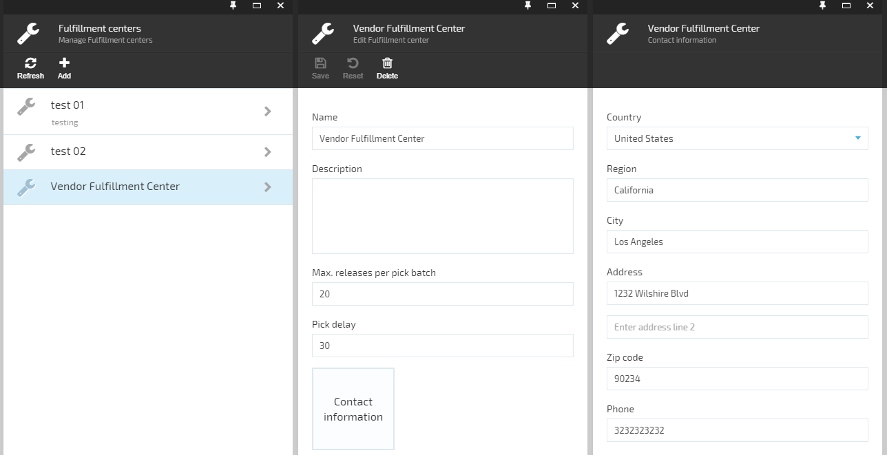

---
title: Fulfillment centers
description: The article about Virto Commerce fulfillment centers
layout: docs
date: 2015-12-15T10:56:36.147Z
priority: 1
---
A Fulfillment center is the location where incoming orders are received from affiliated stores or locations. These <a class="crosslink" href="https://virtocommerce.com/shopping-cart" target="_blank">orders</a> are processed and filled.

## How do I add a Fulfillment center?

Open **Configuration** -> **MODULES** -> **Commerce core module** -> **Fulfillment centers** in the Commerce manager. A list of fulfillment centers is displayed. Click "Add", fill Name, click **Contact information** widget and fill the required fields in a form displayed. Click "Save".

A list of Fulfillment centers and the management form of sample fulfillment center.
