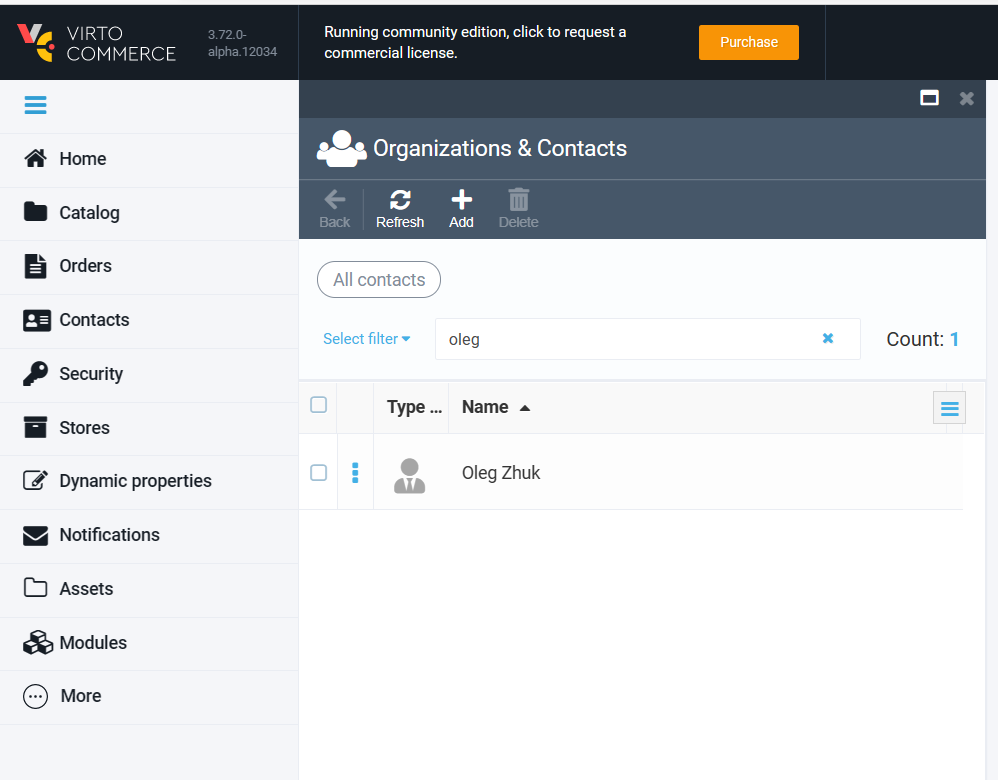
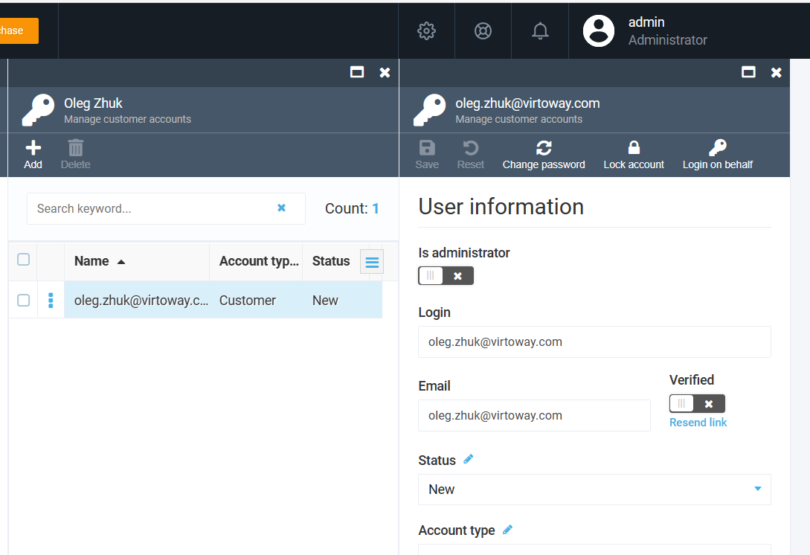
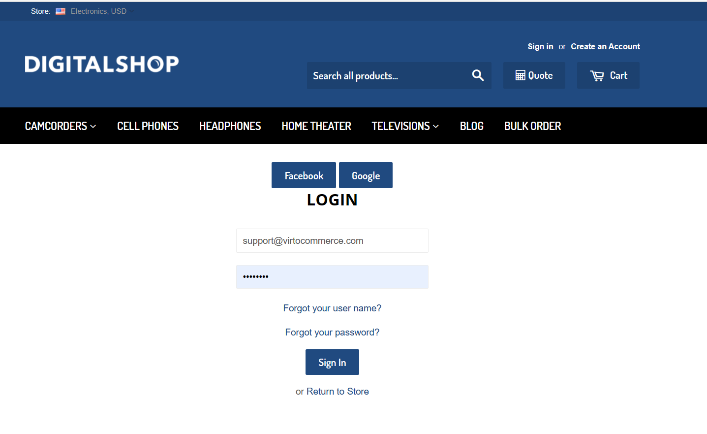
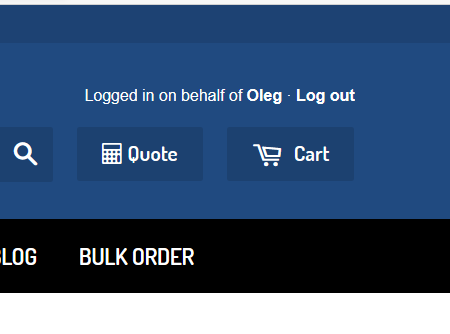

# Login on behalf

## Overview

If you are an administrator or a support personnel on Virto Commerce based web store, you can log in under another user credentials. This functionality is called `Login on Behalf`. You may wish to do this to see what a user sees in the webpage, help to place an order and even make a payment on their behalf.

!!! note
    Every login on behalf session is recorded in the sign-in log, including who the operator
    was, which account they acted as, the IP address and the time. These records are always
    written and cannot be disabled.

## How it works
`Login on Behalf` feature which helps to increase the productivity of web store personnel. It also contributes significantly to customer satisfaction and brand loyalty while decreasing the number of abandoned carts.

When a user reports a problem with an order processing operation or a bug founded, support staff often need to look at the screen through the eyes of that person. This is especially important in cases where an error occurs in the application since it can be difficult to re-create the error.

Also, this “Login on Behalf” feature helps to efficiently work in-house on the site. For example, a more experienced admin can help a sale person to bulk adding of products from the Excel file, as well as perform other operations on the ecommerce site webpages.

## Step by step instruction

Sign-in into Virto Commerce Portal with Customer Support Account.

For example: support@virtocommerce.com.

!!! note
    Role and permission should be created and assigned properly. 

Select Contacts.

Use either full-text search or filter to find Customer. Ex: Oleg.

Select Accounts, select Account (one customer can have several logins to different stores) and click 'Login on behalf`.

Virto Commerce opens a new tab with storefront.

!!! note
    For security reason, need to re-enter you customer support login and password.

If all is OK, you will login on behalf into customer account.

And help customers to find the products, add products to the cart, complete the order, etc.

## Security

All actions take place inside the customer account, but `Created by` and `Modified by` are
recorded against the customer support account, not the customer.

To review login on behalf activity, open the account and use the **Sign-in log** widget, or
filter the sign-in log by the *On behalf* type. The log also shows the live session in
**Active sessions**, marked with the operator's name, where it can be terminated.

Reading the sign-in log requires the `platform:security:sign_in_log:read` permission.

!!! warning
    The `platform:security:loginOnBehalf` permission is not limited to customer accounts. An
    operator holding it can sign in as any user, including an administrator, and the resulting
    session carries that user's full permissions. Grant this permission only to trusted support
    staff. Login on behalf activity is recorded for audit, but it is not restricted.
