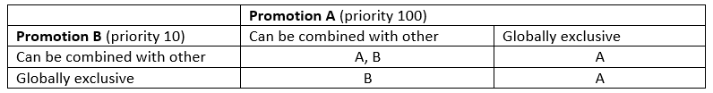
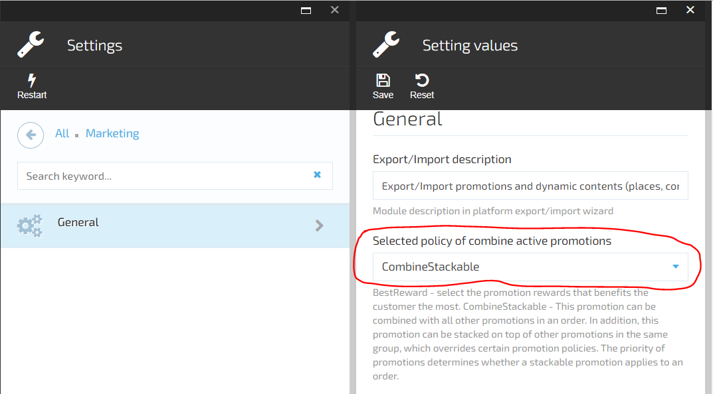
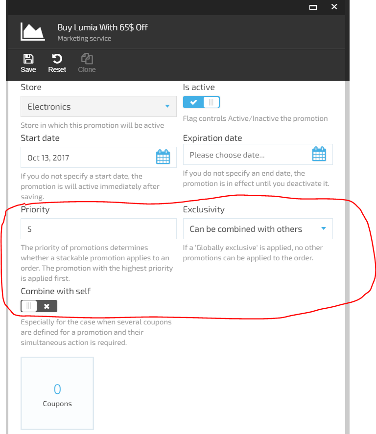

---
title: Combine active promotions
description: The list of articles about how to combining promotions works in Virto Commerce
layout: docs
date: 2017-10-16T15:17:39.347Z
priority: 3
---
## Introduction
Currently Virto Commerce marketing module represent two base promotion combination policies.
* **Best reward policy** - select the promotion rewards that benefits the customer the most.
* **Combine stackable policy** - If your store has multiple active promotions, shoppers can qualify for multiple promotions at a time..

## Combine promotions stackable policy

With this policy each promotion can be combined with all other promotions in an order.
In addition, resulting promotion  rewards can be stacked on top of other promotions rewards  in the same reward group (shipment, item, order), which overrides certain promotion policies. 
The priority of promotions determines whether a stackable promotion rewards applies to an order. 

The following table detail how promotions rewards are applied compared to other promotions. How promotions are applied is based on different priorities and the exclusivity with other promotions settings:

> Also stackable combination policy has a constrain which checks if the order total or any object price is less than zero after a promotion is applied.
If the order total or entry price is less than zero, the  this reward will be skipped and taken next reward by promotion by priority.

How to switch on the promotions stackable combination policy:
*	Open Settings -> Marketing -> General
*	Choose  **CombineStackable** value for setting **Selected policy of combine active promotions**. Notice: This setting will be applied only after application restart.

*	Open Promotion detail blade, there will appear new fields **Priority**, **Exclusive within an order**, **Combine with self**. Use these field you might control the  promotions combinations behavior. 

## Best reward policy
As a result of this combination policy, no rewards are stacked, and the user receives only the best rewards for each group (which is most beneficial to the client)
