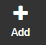
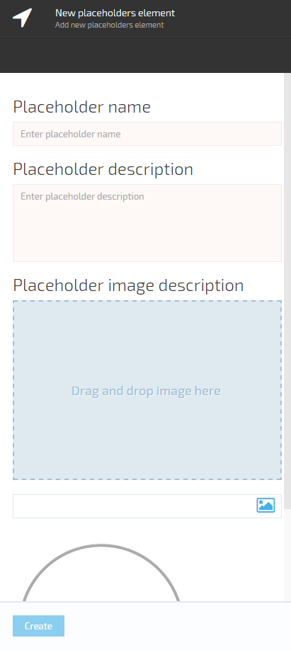

---
title: Registering Content Placeholders
description: The article about registering advertising spot content placeholders in Virto Commerce
layout: docs
date: 2015-11-12T07:30:23.533Z
priority: 1
---
## Introduction

Content Placeholders must be registered in <a class="crosslink" href="https://virtocommerce.com/b2b-ecommerce-platform" target="_blank">Virto Commerce</a> platform manager and in Storefront theme template before Dynamic Content can be delivered within them. By default, the Content Placeholders provided with VirtoCommerce are already registered. However, if you add new or rename existing Content Places, you will need to register them following the steps below. Remember, you only need to register a Content Place once. Once registered, the Content Place becomes available for assignment to multiple pieces of Dynamic Content.

> Your user account must have the Manage Content Places granted permission to perform these tasks in VirtoCommerce administration application.

## Register dynamic content place in strorefront theme template

To register dynamic content placeholder in storefront theme template only need add folow line 

```
<vc-content-place id="Placeholder identity here"></vc-content-place>
```

You can do it by two ways 

* In manager UI Content->Themes->Edit Css/HTML
* Manual in Storefront/App_Data/Themes/{{Store theme name}}

In manager UI Content->Themes->Edit Css/HTMLManual in Storefront/App_Data/Themes/{{Store theme name}} 

## Register dynamic content place in manager

* Open **Marketing** module
* Select **Dynamic Content**
* Go to **Content Placeholders**
* Click **Add** button

* In the wizard blade set Name, Description fields.

Name should match the area name in the page template created by the web developer.
In the description field you can provide some additional information on the content placeholder e.g. Width/Height to support marketers with additional information while they create Dynamic Content for the Content Placeholder.
Also you can add default image for the placeholder.
* Click **Create** button.

The created Content Placeholder will be added to the list and can be used for Dynamic Content displaying.

## Editing Content Placeholder

* Open **Marketing** module.
* Select **Dynamic content**.
* Select **Content Places**.
* Click the selected Content Placeholder or click it and click **Edit** button in the toolbar above the list.
* Edit the required fields.
* Save changes.

## Deleting Content Places

* Open **Marketing** module.
* Select **Dynamic content**.
* Select **Content Placeholders**.
* Select Content Placeholder you want to delete.
* Click **Delete** button in the blade of the placeholder.
* Confirm deletion.

> Content Placeholders can be easily deleted even if they are used in any registered Content Publishing. The only conciquence of this is that the Content Publishing won't be available while evaluating Dynamic Content for that area.
