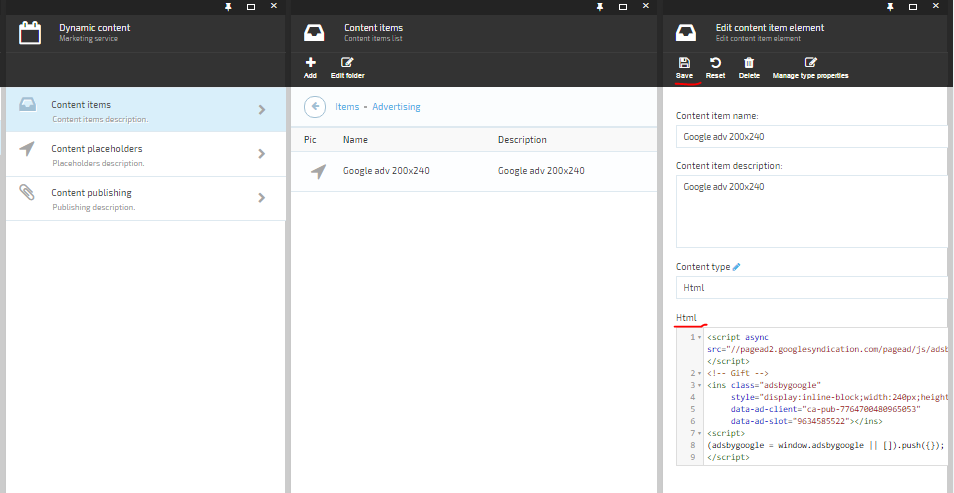

---
title: How to add an advertising spot via Marketing?
description: The list of article about adding an advertising spot via marketing in Virto Commerce
layout: docs
date: 2016-02-03T13:53:58.500Z
priority: 2
---
There are steps to prepare dynamic content infrastructure.

* [Create a content item](docs/vc2userguide/marketing/how-to-add-an-advertising-spot-via-marketing/create-a-content-item)
* [Create a content placeholder](docs/vc2userguide/marketing/how-to-add-an-advertising-spot-via-marketing/create-a-content-placeholder)
* [Create a content publishing](docs/vc2userguide/marketing/how-to-add-an-advertising-spot-via-marketing/create-a-content-publishing)

## Add content place to a page

There are steps to add a dynamic content to a website page:
* Open a website page html file.
* Insert code to your Html, where Id is В placeholder name
`
<vc-content-place id="Right banner 240x400" class="col-sm-4 col-md-4 rightblock"></vc-content-place>
`

## Add real advertising content

* Go to Marketing module.
* Select **Dynamic content** in the module blade.
* Select **Content items** in the opening blade.
* Select content item to apply with new content. It is "Google adv 200x240" inВ [Create a content item](docs/vc2userguide/marketing/how-to-add-an-advertising-spot-via-marketing/create-a-content-item)В example.
* Insert into Html google ads snippet:

```
<script async src="//[pagead2.googlesyndication.com/pagead/js/adsbygoogle.js"></script]()>  
<!-- Gift -->  
<ins class="adsbygoogle"  
 style="display:inline-block;width:240px;height:400px"  
 data-ad-client="ca-pub-7764700480965053"  
 data-ad-slot="9634585522"></ins>  
<script>  
(adsbygoogle = window.adsbygoogle || []).push({});  
</script>
```


* Save changes.

New content will allow immediately on your website page.
