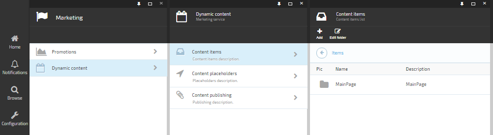
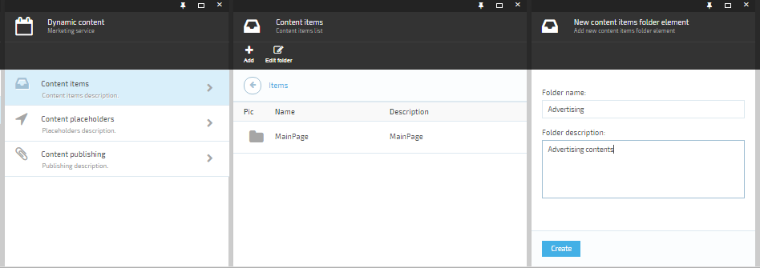
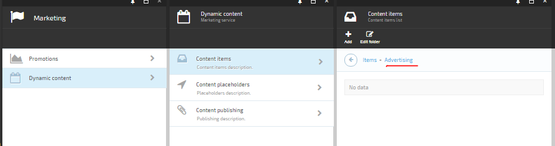
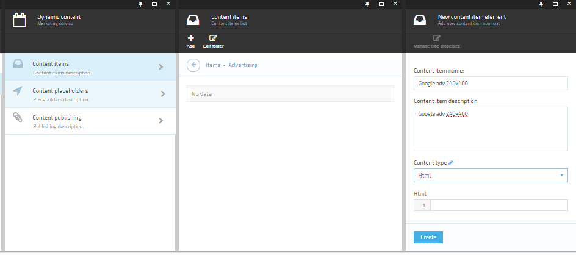

---
title: Create a content item
description: The article about creating an advertising spot content item
layout: docs
date: 2016-02-03T13:02:59.170Z
priority: 1
---
There are steps to create a content item

* Go to Marketing module.
* Select **Dynamic content** in the module blade.
* Select **Content items** in the opening blade.

In order to manage your content easily you should create a folder structure. This structure like file system structure where files are content items.
* Add a new folder for advertising contents by clicking on **Add** toolbar command.
* Select "Content items folder" on the opening blade.

* Type name and description. Click **Create** button.
* Go to created folder by clicking on it.

* Add content item by clicking on **Add** toolbar command.
* Select "Content item" on the opening blade.
* Type name and description. Set "Content type" to "Html". Click **Create** button.

Content item created. In order to set a content to the content item see "Add real advertising content" below the instruction.
