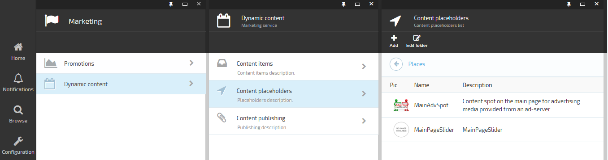
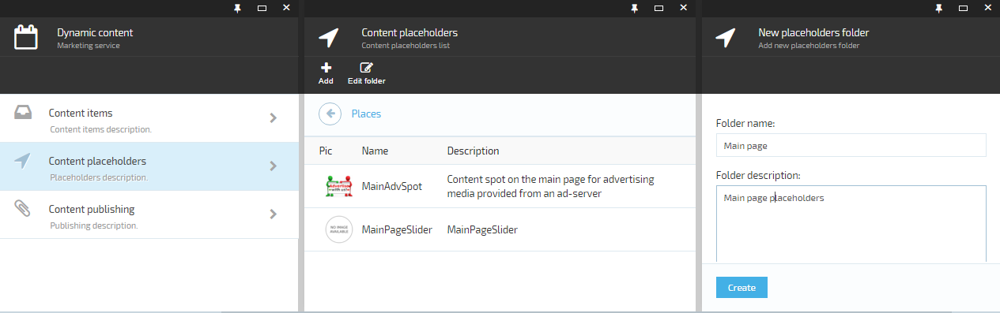
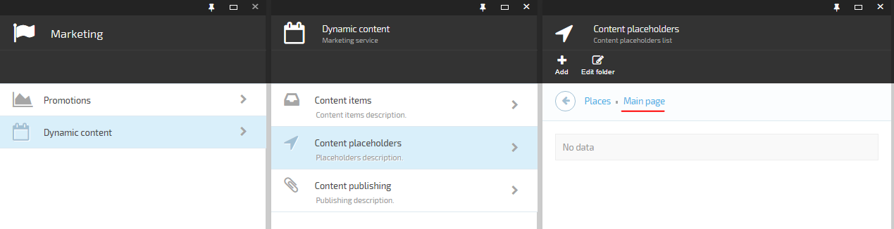
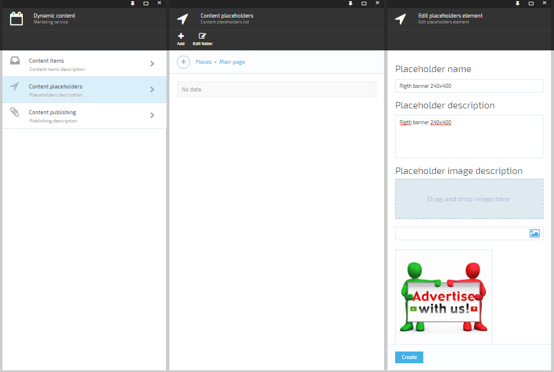

---
title: Create a content placeholder
description: The article describes steps to create a content placeholder on Virto Commerce Storefront
layout: docs
date: 2016-02-03T13:05:41.793Z
priority: 2
---
There are steps to create a content placeholder.

* Go to **Marketing** module.
* Select **Dynamic content** in the module blade.
* Select **Content placeholders** in the opening blade.

In order to manage your placeholders easily you should create a folder structure. This structure like file system structure where files are content placeholders.
* Add a new folder for advertising placeholder by clicking on **Add** toolbar command.
* Select "Placeholders folder" on the opening blade.

* Type name and description. Click **Create** button.
* Go to created folder by clicking on it.

* Add placeholder by clicking on **Add** toolbar command.
* Select "Placeholder" on the opening blade.
* Type name and description. Load an image. Usually, the image is screen-short of your site page with marked placeholder. Click **Create** button.

