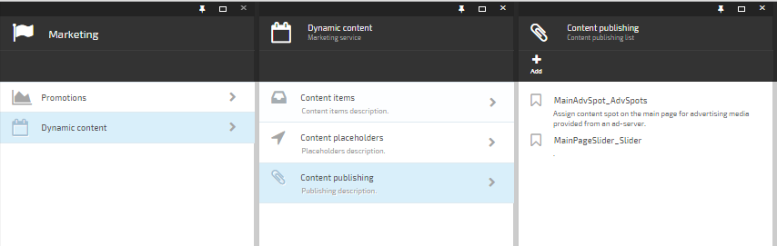
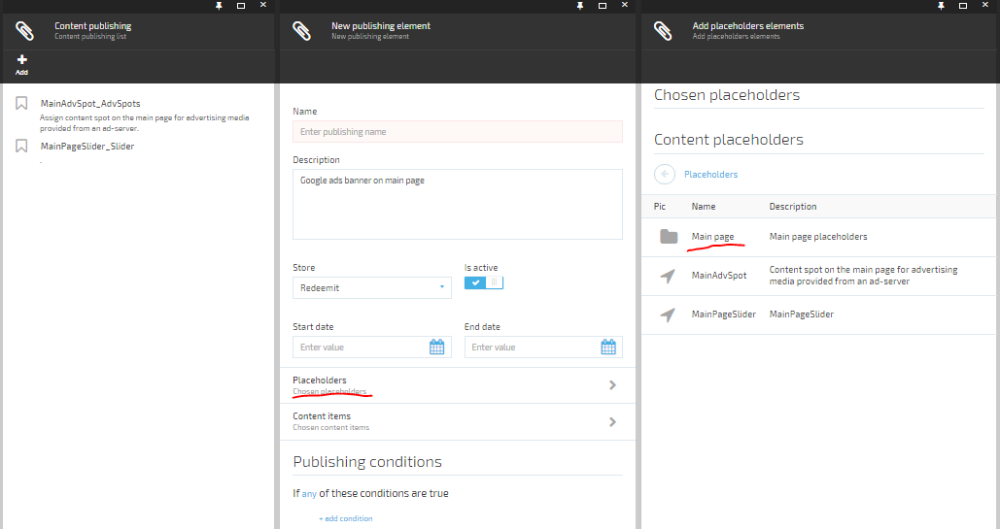
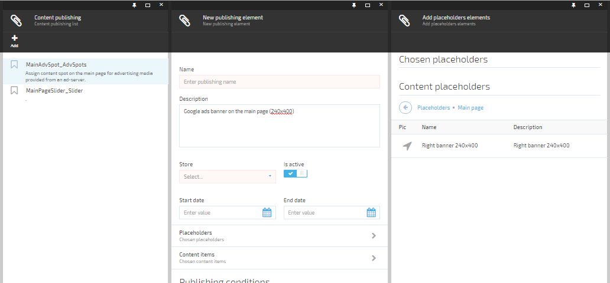
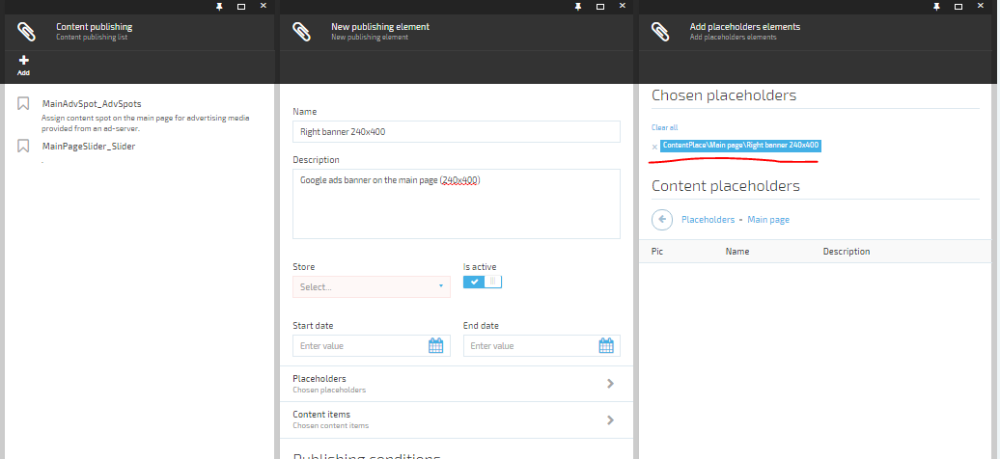
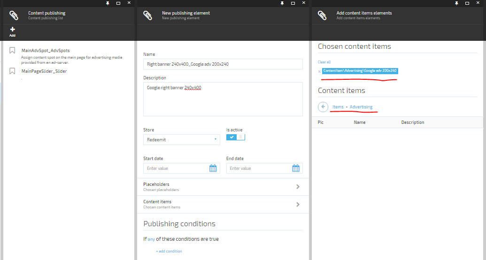
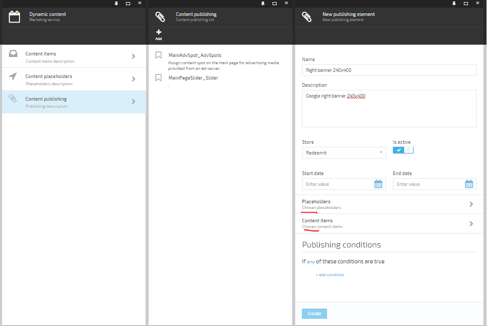

---
title: Create a content publishing
description: The article about creatint an advertising spot content publishing
layout: docs
date: 2016-02-03T13:34:46.603Z
priority: 3
---
There are steps to create a content publishing:

* Go to **Marketing** module.
* Select **Dynamic content** in the module blade.
* Select "Content publishing" in the opening blade.

* Add publishing by clicking on **Add** toolbar command.
* Type a description.
* Select a store
* Pick up "Placeholder" by clicking on "Placeholders".

* Select "Main page" in the opened blade.

* Select "Right banner 240x200"

* Pick up "Content item" by clicking on "Content items". To do this select Advertising folder and click on "Google adv 240x400".

* Create content publishing by clicking on **Create** button.

