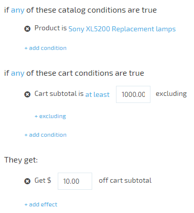
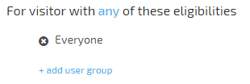
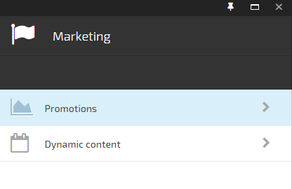
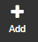
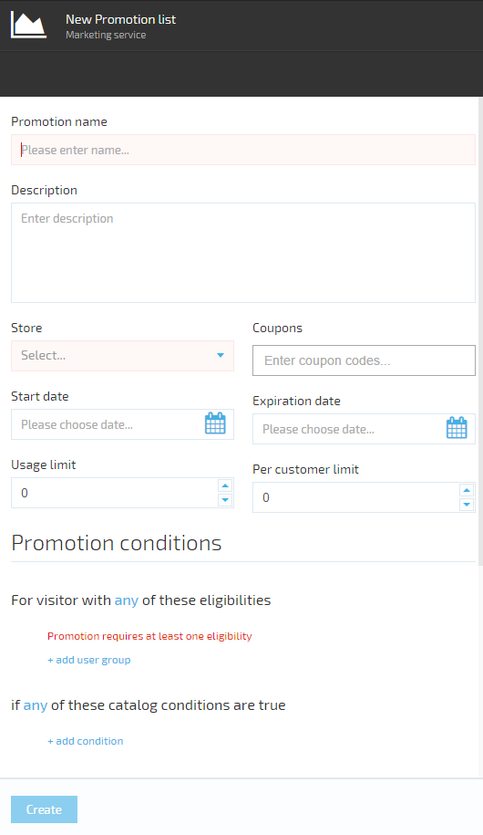
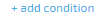
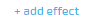

---
title: Managing promotions
description: The list of articles about setting promotions in Virto Commerce
layout: docs
date: 2015-06-03T15:17:39.347Z
priority: 3
---
## Introduction

A <a class="crosslink" href="https://virtocommerce.com/ecommerce-marketing" target="_blank">promotion</a> is a marketing tool used to increase sales. Promotions are store-specific; to create a promotion for a store, you must have the Manage Promotions permission. Promotions cannot be shared across multiple stores.

> To apply a promotion to multiple stores, it must be manually re-created in each applicable store

## Promotion rules

Promotion rules define the behavior and effects of promotions. There are two types of promotion rules:
* conditions
* effects

## Conditions

There are two condition groups:
* catalog conditions
* cart conditions

Below is the description of each of them.

### Catalog promotion conditions

Catalog promotion conditions are used to make specific products and categories of products more attractive to shoppers through incentives, such as lowered pricing on a particular brand. A catalog promotion condition grants all shoppers a discount on a specific product or set of products. Promotion with matching catalog conditions are always visible to shoppers, so the price they see while browsing the site is the price they pay at checkout time (except taxes and any promotions with matching shopping cart conditions that may apply).

### Cart promotion conditions

Cart promotion conditions are used to encourage shoppers to increase their order size by providing incentives, such as free shipping on orders over a certain sum. A shopping cart promotion conditions grants a discount on a specific product or set of products to shoppers who meet them. Cart promotions are only applied after the promotionВ conditionsВ expression returnedВ *true*. Thus, a shopper only sees the price that will be paid for a promoted item when it's viewed in the shopping cart or during checkout (assuming all the promotion's conditions are met).

For example, a product has a <a class="crosslink" href="https://virtocommerce.com/price-engine" target="_blank">list price</a> of $100.00. Currently, there is a shopping cart promotion that grants a 5% discountВ toВ all orders over $99.00. When browsing the catalog, all shoppers see the product's $100.00 list price. If a shopper adds the product to the <a class="crosslink" href="https://virtocommerce.com/shopping-cart" target="_blank">shopping cart</a> and then views the cart's contents, the price of the cart is $95.00 (due to the 5% discount). If the same shopper goes back to browsing theВ frontend, the catalog still shows the list price of $100.

Conditions are the set of criteria that determine, based on the current state of the cart, whether a shopper is eligible for a promotion. Examples of conditions are:

* the cart must contain a particular quantity of a certain product
* the cart subtotal must be greater than a specific amount

## Effects

Effects specify what benefits are granted by a promotion. They are the incentives used to encourage customers to purchase more or to purchase specific items. Examples of effects are:
* free shipping
* discounts on specific products
* free items
* coupons for discounts on future purchases.

There are many options available when configuring promotion rules. For detailed descriptions of the available options, see **Promotion Conditions and Rules**.

## Expression builder's visitor block

The visitor block is similar to promotion rules. It specifies criteria that determine, based on information that has been collected about the visitor, whether that visitor is eligible to receive a promotion.

There are three options:
* *Everyone* - no filtering
* *Register user - *user that is currently logged in to storefront
* *First time buyer* - registered user who has never made any purchase

> User that has just created an account is always a first time buyer

## Activation rules

Activation rules determine how promotions are applied to the eligible purchases. In the simplest case, a promotion is applied automatically. This means that, if the customer meets all conditions, he receives the promotion action automatically, whether it's a discount on an item, free shipping, a coupon, etc.

Some promotions need to be "activated" by a coupon code (also referred to as a promotion code). For example, to receive a discount on an item in the shopping cart, the customer must enter a coupon code at checkout time. If your organization uses coupon codes, you will need to configure certain rules to control how they can be used with each promotion.

When you create a promotion, you need to specify whether it's activated automatically or by a coupon.

## Coupons

Coupons can be used by any eligible customer. This means that any customer who qualifies for a promotion can use coupon code associated with that promotion. Customers may re-use a previously redeemed coupon code.

## Promotions Best Practices and Tips

* Do not use the promotions to create permanent discounts. Instead, create sale prices in the appropriate <a class="crosslink" href="https://virtocommerce.com/price-engine" target="_blank">price lists</a>.
* Promotion rules are cached to improve performance in the frontend. As a result, there is a delay after a promotion is created and before it appears in the store. The delay depends on the configuration

## Creating a promotion

* Open Marketing module.
* Select **Promotions** tab.

* In the opened blad click **Add** button.

* In the wizard blade setup promotion properties.

|Field name|Description|
|----------|-----------|
|Promotion name|Sets the name of the promotion. Set it as meaningful as possible for the later search purposes.|
|Description|Sets the meaningful description of the promotion.|
|Store|The store to which the new promotion applies.|
|Start date|Sets the start date of the promotion. Available from the creation if not set.|
|Expiration date|Sets the end date of the promotion. Available until disabled if not set.|
|Usage limit|Sets the maximum amount of times the promotion can be applied. If set 0 the promotion will be limitless.|
|Per customer limit|Sets the amount of times the promotion can be applied to the same customer. If set 0 the promotion will be limitless.|
|Promotion conditions|Setup promotion rules (conditions) under which the promotion will be applied.|

To setВ usergroupВ clickВ  and select the targetВ usergroup.
To setВ condtionВ clickВ  select required condition and setup required values of the selected condition.
To set effect clickВ В select required effect and setup values.

* Click **Create**.

The created promotion will be saved and displayed in the list of promotions.

## Editing Promotion

* Open **Marketing** module.
* Select **Promotions** tab.
* Double click the selected Promotion.
* Edit the required fields.
* Save changes.

> You can't edit Store for the Cart promotion and Catalog for Catalog promotion.

## Deleting Promotion

* Open **Marketing** module.
* Select **Promotions** tab.
* Click the Promotion you want to delete.
* Click **Delete** button
* Confirm deletion.
