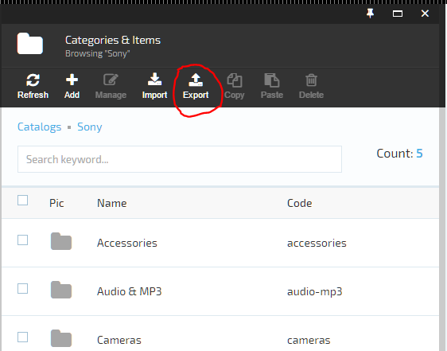
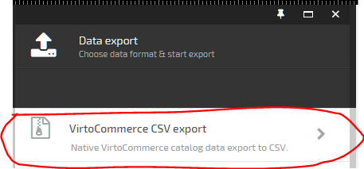
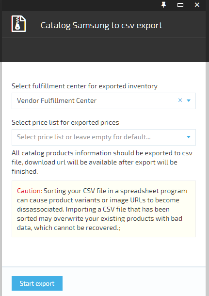
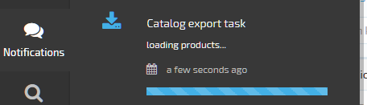
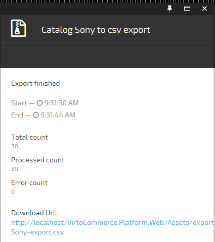

---
title: Catalog export
description: In this how-to we described how to export Virto Commerce catalog in CSV format
layout: docs
date: 2015-08-13T17:24:00.507Z
priority: 2
---
You have ability to export whole <a class="crosslink" href="https://virtocommerce.com/product-information-management-software" target="_blank">catalog</a> or some selected products or categories to one of defined formats. If you want to know how extend VCF with new export data format you can read how to write own catalog export extensions.

In this how-to we described how to export catalog as csv format.

Here are a few examples of what you can do with exported data:
* import to another system
* edit your products in bulk. Instead of editing products one at a time, you can save time by exporting your products to a CSV file. You can make changes to the CSV file, and import the CSV file to update your products.
* move to another working VCF platform  instance (staging, production)

## Start exporting products to CSV

Define what you want to export
*  whole catalog
*  concrete categories
*  products 

To begin export select specific objects or nothing if you want to export the entire catalog and click the export action in the toolbar.

  

In next screen need select the appropriate exported format from the list presented, in our case it will be csv.

Now select price list, which prices and warehouse and which inventories will be exported.

## Control export progress

In nextscreen click the `Start export` button and the system will start the exporting process.

You will be informed about your exporting progress status by a special notification event in the notification area and in the blade that contains exporting progress information and errors.

## Get resulting data  

After the export process is finished you can download the resulting file by a special url in the blade that contains export progress information.

The resulting csv file contains product information (fields, seo, reviews, properties, images), and store default price.

