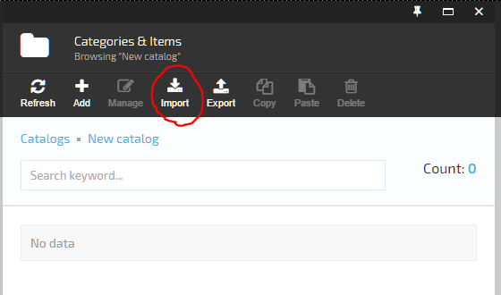
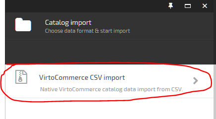
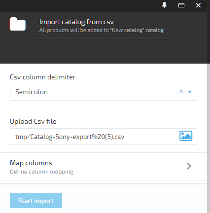
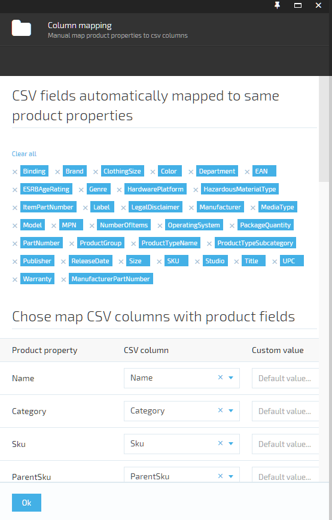
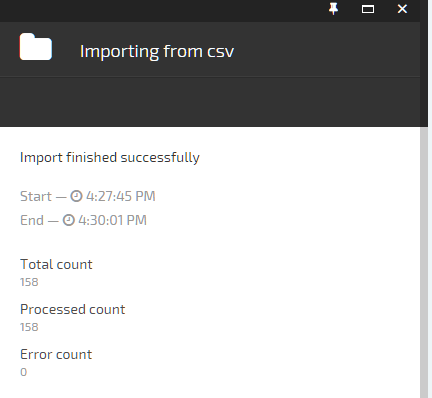

---
title: Catalog import
description: The article about Virto Commerce catalog import
layout: docs
date: 2015-08-13T17:24:00.507Z
priority: 3
---
## Introduction

<a class="crosslink" href="https://virtocommerce.com/product-information-management-software" target="_blank">Catalog data</a> can be created manually, but when catalogs consist of large amounts of data (specially when importing data from the third-party application), manual data creationВ is an inappropriate and irrational option. The same when user needs to edit data in bulk. That is why Virto Commerce allows store administrators to import catalog data via special import manager tool from CSV (comma-separated value) files.

## Importing Catalog data

Choose the catalog data you want to import and click the import button in the catalog content blade's toolbar.

Next, choose CSV import format

In following blade you should select csv delimiter and upload the CSV file with the data to be imported.

## Column mapping

In next step user needs to map columns of the uploaded CSV file to corresponding catalog system object fields. You can read more about columns inВ [understanding catalog objects export columns](docs/vc2userguide/merchandise-management/catalog-export).

All CSV columns that are not mapped to catalog object column will be automatically converted to product property when importing. If you don't want to map some CSV columns to product properties just remove them from the list. Or remove all by clicking "Clear all" if you don't need any.

## Import progress

Next, click start import and wait untill import process will be completed.

