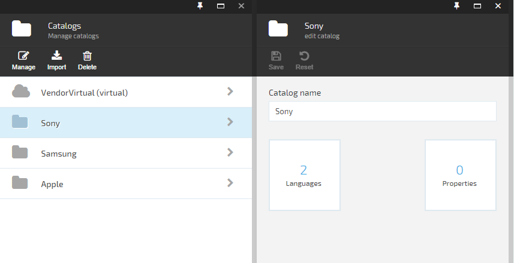
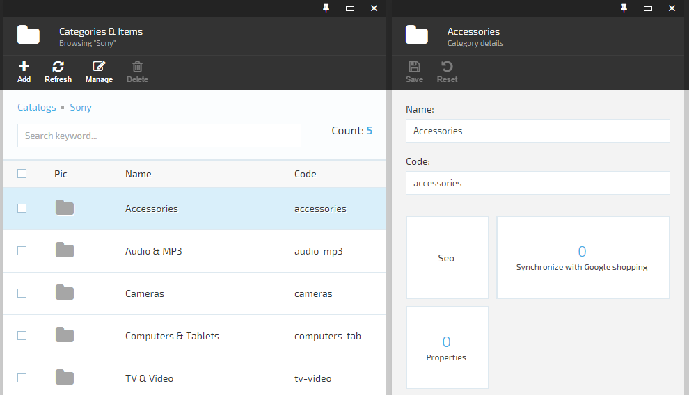
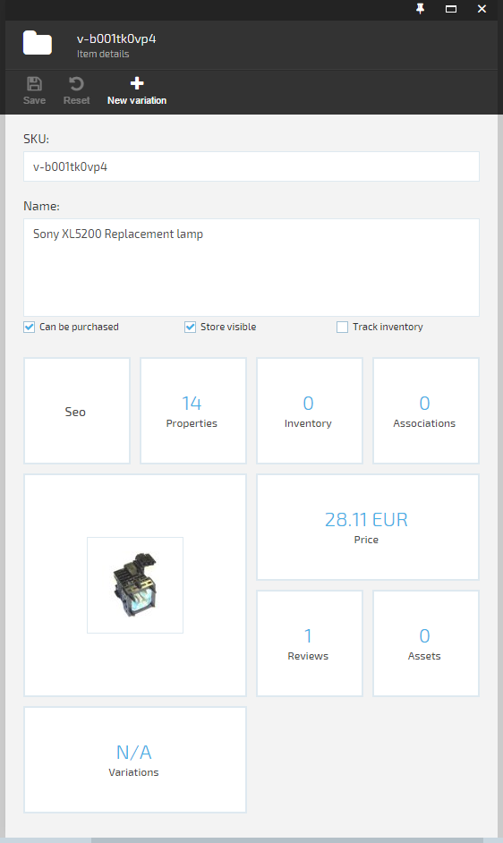
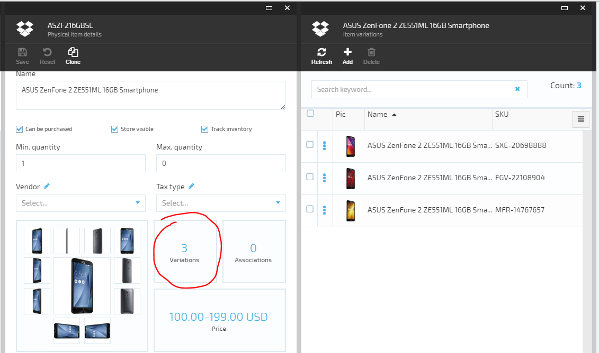
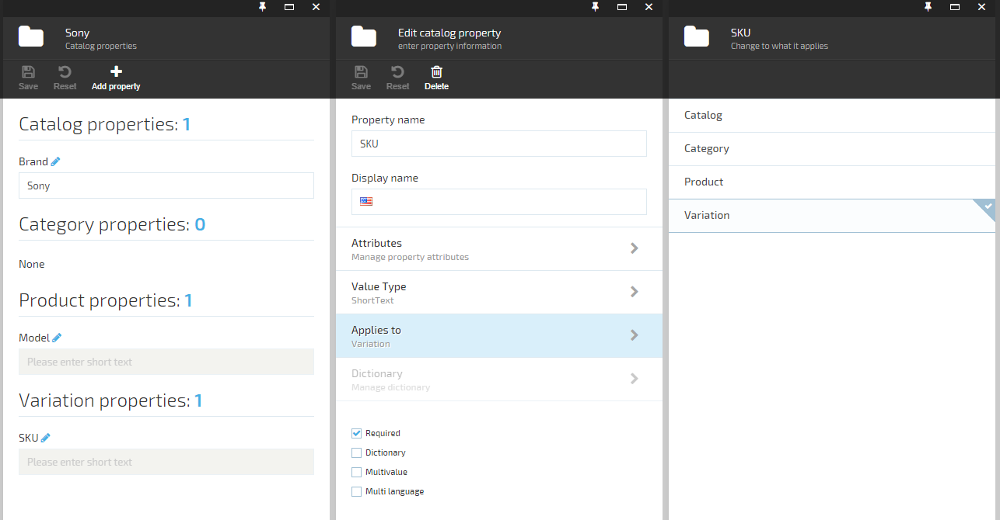
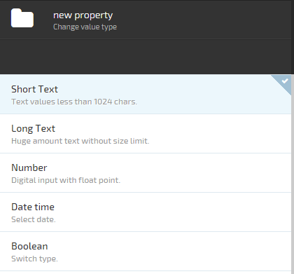
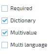
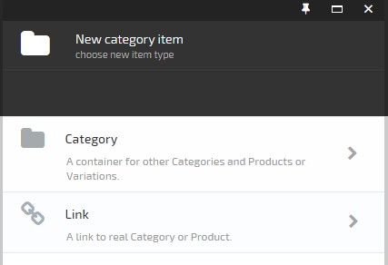

---
title: Products catalog
description: Catalog module presents the ability to add items to your e-commerce store. Anything you sell we call it an item. It can be electronics, groceries, digital content or anything else. Items can be grouped into categories and catalogs. The item grouping is individual depending on the stock size, item types, vendors, etc.
layout: docs
date: 2016-07-06T09:27:43.340Z
priority: 1
---
## Virto Commerce Catalog module

Catalog module presents the ability to add items to your e-commerce store. Anything you sell we call it an item. It can be electronics, groceries, digital content or anything else. Items can be grouped into categories and catalogs. The item grouping is individual depending on the stock size, item types, vendors, etc.

## Common catalogs

A (common) <a class="crosslink" href="https://virtocommerce.com/product-information-management-software" target="_blank">catalog</a> is defined as a list of items or services that a company showcases online. Physically catalog is a collection of items, which can be grouped into categories. An item can be assigned to only one category or be direct child of catalog without category.

In which cases catalogs are supposed to be used? For example, when a number of different trademarks or product lines is operated. Each trademark or product line should have its own catalog of all the offerings in that category. Or when dealing with several suppliers. In this case each supplier should have its own catalog with offered items.

## Categories

A category is container for other categories or items. Category in the catalog can have sub-categories. Categories allow building hierarchy and relationship between various items in the catalog. This helps to make it easier for customers to navigate to the items they would like to purchase. Large catalogs containing many items should be organized using parent-child relations.

## Items (products)

There is an ambiguity between Product and Product with variations definition in e-commerce.
In the first case product is the real SKU and can be identified in the accounting system, can have its own description, price etc.  
In the second case product is not the real SKU item but the container for a group of real products (variations) that can be sold and differs only by some variative properties.

In <a class="crosslink" href="https://virtocommerce.com/b2b-ecommerce-platform" target="_blank">Virto Commerce</a> we decided to get rid of the ambiguity between Product and Product with variations. That is why we define only products with SKU. In case there is a need to add variations of the product a relation should be implemented between such a products as well as special type of variative properties definition added. Thus a product with its variations in the system is presented as a collection of products (variations). One of the products is the title (main) product being one of the variations at the same time. The title product has variative property values set. And all other products (variations) has the relation with the title product. Every product that has relation to the title product (variation) can inherit some property values of the title product (description, assets etc.) but can also override the values of those properties if they differ from the title product (variation) property values.

To show such a product with variations on the storefront, the title product (variation) is loaded with all the related products (variations). Property values of the title product (variation) are used for the main product description. SKU selector for such a product with variations is built using variations properties of the title product and all of it's variations.

So an item concept in Virto Commerce is a generalization of Variation/SKU or Product. An item corresponds to item in the store that can be promoted and sold.

User can manage simple items properties as well as complex information:
* custom properties;
* SEO information;
* associations (associated items);
* assets;
* images;
* variations (SKUs);
* editorial reviews;
* inventory;
* prices.

Inventory and prices management are integrations from other modules - `Virto Commerce Inventory` and `Virto Commerce Pricing` respectively.

## Variations

There is an ambiguity between Product and Product with variations definition in e-commerce.  
In the first case product is the real SKU and can be identified in the accounting system, can have its own description, price etc.  
In the second case product is not the real SKU item but the container for a group of real products (variations) that can be sold and differs only by some variative properties.  
In VirtoCommerce we decided to get rid of the ambiguity between Product and Product with variations. That is why we define only products with SKU. In case there is a need to add variations of the product a relation should be implemented between such a products as well as special type of variative properties definition added. Thus a product with its variations in the system is presented as a collection of products (variations). One of the products is the title (main) product being one of the variations at the same time. The title product has variative property values set. And all other products (variations) has the relation with the title product. Every product that has relation to the title product (variation) can inherit some property values of the title product (description, assets etc.) but can also override the values of those properties if they differ from the title product (variation) property values.  
To show such a product with variations on the storefront, the title product (variation) is loaded with all the related products (variations). Property values of the title product (variation) are used for the main product description. SKU selector for such a product with variations is built using variations properties of the title product and all of it's variations.

## Properties

Properties (or custom properties) is the additional characteristics for your catalog entities. They can be defined at different levels of item hierarchy:

* catalog - value assigned in catalog level;
* category - value assigned in category level and can be overwritten in child categories;
* product - value assigned in item or variation level;

All properties defined in parent hierarchy entities are available in (inherited by) item. E.g. every item inside catalog will have property `Brand` with value `Sony` once it was defined in parent catalog and was assigned such value there.

Every property has its `Assign to` trait set to one of: `catalog`, `category`, `product` or `variation`. This defines at what level the propertys value can be set. 

Property value type has to be defined. That means property can store only values of that type.

Available property types are:
* Short text (stores strings of length not more than 1024)
* Long text (stores very long multiline text)
* Number (stores numbers integer or float)
* Date time (stores date & time values)
* Boolean (stores boolean value)

Properties has attributes. That is meta data of the property. User can set name and value of the attribute.

Property has following settings:
* **Required**. Value for the property must be provided. Otherwise it wont pass validation.
* **Dictionary**. User can provide available values for it.
* **Multivalue**. User can define more than one value for that property.
* **Multi language**. User can provide values for every language that is available in the catalog.

if property is checked as `Dictionary` and `Multivalue` that means user can define more than one value for the property, but only from the list of available values.

## Virtual catalogs

Virtual catalogs are created from one or more common catalogs or their subsets. This kind of catalogs aggregates multiple base catalogs subsets into a single catalog. Virtual catalogs are generally used to display goods that can be collected from multiple catalogs. A good example would be to have several common electronics brand catalogs of products. And combine them into one virtual catalog of electronics to be able to sell them in one multi brand online electronics store.

A virtual catalog must have a unique name different from other virtual and common catalogs. Though virtual catalogs are composed of items and categories from common catalogs, items from a virtual catalog cannot be added to another virtual catalog.

The major difference between catalog and virtual catalog is that the second one is just a view of items from common catalogs. Physically all items from a virtual catalog are located in common catalog(s). This also means that if a modification is made to an item in the common catalog, the update will be reflected in all virtual catalogs instantly.

Common and linked categories can be defined in the virtual catalog.

## Linked category

Linked category is the category that maps one of the common catalogs category and all its structure with subcategories and products with the link to the virtual catalog or its common category.

## Common category

Common category has the same meaning as the category in common catalogs. User can create common category and link products to it or create linked category in it.

catalog CRUD:
* properties

category CRUD:
* properties
* seo

virtual catalog CRUD:
* categories
* including categories from other (real) catalogs

expandability points:
* additional widgets in (virtual) catalog detail
* additional widgets in category detail
* additional widgets in item detail
