---
title: Working with taxes
description: The article about working with taxes in Virto Commerce
layout: docs
date: 2015-10-07T12:28:24.127Z
priority: 2
---
## Avalara AvaTax tax calculation integration module

### Introduction

Keeping tax rates actual manually is a challenge. You have to track tax rate changes. That is why there are number of tax calculation services. They take care about tax calculation precision if required information provided correctly (order item codes, shipping rates, amounts, quantities, exemptions, addresses).  

We use <a href="http://www.avalara.com/products/avatax/" rel="nofollow">Avalara AvaTax</a> as a service to deliver precise tax calculations. In order to use this service you need to have an account in Avalara system.

### Installation

To use AvaTax service you need first to install AvaTax integration module. Download Avalara module from the VirtoCommerce AppStore and install it as any regular module. How to install module see [Modules management](docs/vc2userguide/configuration/modules-management).

### Configuration

Starting the VirtoCommerce 2.5 version there are two options to configure AvaTax credentials.

First option is the one we had earlier. That is configuring settings globally. For that purpose you need to enter Avalara provided credentials to VirtoCommerce platform from AvaTax module settings menu:
* Login to VirtoCommerce platform manager with permissions that allow to edit module configuration.
* Navigate to "Modules" menu item.
* Open "Avalara tax" module.
* In the module details blade's menu click "Settings".
* In the module settings blade enter credentials required and provided by Avalara.

The second option we added starting from VirtoCommerce 2.5 version is configuring Avalara credentials on per store basis. That way each store in the system can have individual Avalara settings. To configure Avalara per store do the following:
* Login to VirtoCommerce platform manager with permissions that allow to edit store configuration.
* Navigate to "Stores" menu item.
* Select the store for which you want to configure Avalara service.
* In the store details blade click "Tax providers" widget.
* In the tax providers blade choose "Avalara taxes" provider from the list. The Avalara configuration blade will open.
* In the Avalara settings blade enter credentials required and provided by Avalara.
* Click "OK" in the bottom of the settings blade.
* Set "Is Active" radio button to "Avalara taxes" to activate Avalara provider for the store.
* Click "Save" in the store edit blade's menu. 

> If you select "Avalara taxes" provider for the store without specifying Avalara credentials for the store the globally available platform settings for the Avalara module will be applied while calculating taxes for orders of that store.

Available settings to configure Avalara service are the following:
* Avalara account number
* Company code in Avalara system
* Avalara account License Key
* Link to Avalara API service
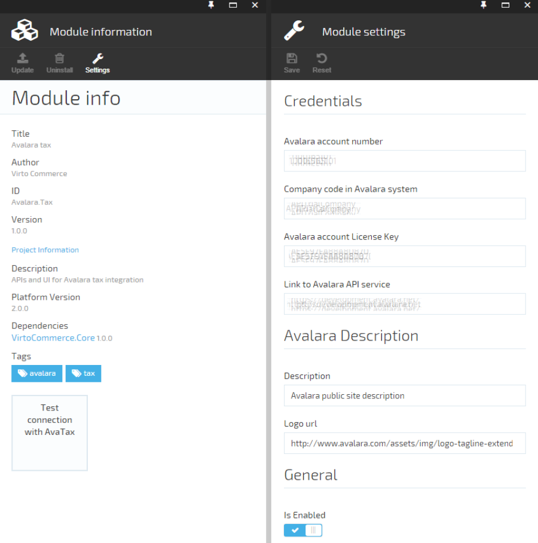

After adjusting module settings:
* Click "Save" to save changes.
* Click the "Test connection with AvaTax" widget.
    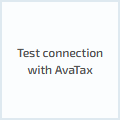
    * If the connection works, the widget will turn green - this means that the link to the Avalara API and Avalara credentials are correct.
        
    * Otherwise, if something went wrong, the widget will turn red, and the error indicator in the blade title will appear. You can click the "See Details" link to display error details.
        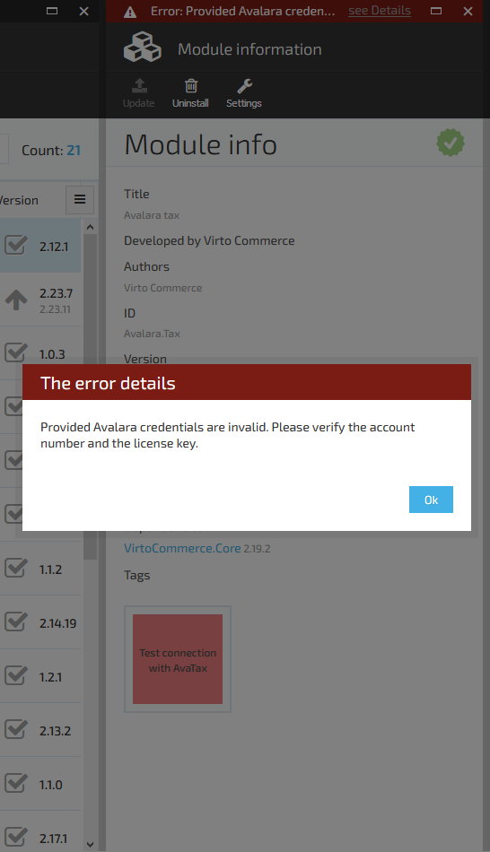

> The test will also fail if "Is enabled" option is turned off. Keep it turned on in production environment.
> 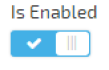

### Enable/Disable tax calculation

There is an option to globally (platform level) enable/disable tax calculation in the module settings.  

Go to Avalara tax module settings edit blade and switch the "Is Enabled" selector to enable or disable tax calculation.  

Click "Save" to save the change.

> Be careful using this option in production environment as it can result the incorrect tax calculation.

### Configuring tax codes

<a class="crosslink" href="https://virtocommerce.com/shopping-cart" target="_blank">Cart/order items</a> should be assigned to tax category in order to calculate taxes correctly. That can be done by applying tax codes to the catalog items. That is called "Tax type" in VirtoCommerce platform. If none of the codes assigned to the item avalara will calculate taxes by applying default code. So if that is the right choice in your case, you can leave "Tax Type" property value blank. Otherwise define available tax types in general settings of VirtoCommerce platform and apply appropriate types to the items. Note that you can apply tax type to the whole category of items. In that case all items in particular category and in nested subcategories will have the selected tax type code.

### Add/delete tax type

Tax type codes are stored in a platform level dictionary setting. The dictionary can be expanded, edited or reduced by configuring it. There are two options to edit tax types dictionary. One is through "Settings". The other and more straightforward approach is to edit it in the category/item edit blade while applying tax type to them.

### Editing in settings

* Login to VirtoCommerce platform web manager with permissions that allows to edit platform settings.
* Click "Settings" in the left vertical menu pane.
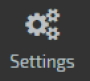  
* Click "Platform" to open platform level settings groups.
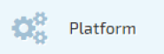  
* Click "General" to open general platform settings.
  
* Click the pen to the right of "Tax types" setting header to begin editing tax codes dictionary.
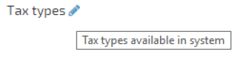  
* In the setting edit blade add/edit/delete tax codes by your needs.  
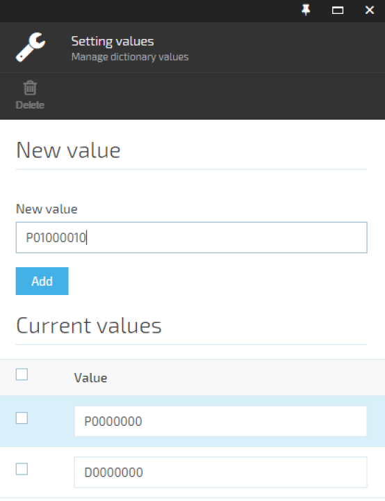  
* Click "Save" in the general settings blade menu to commit made changes.  
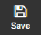

### Editing in category/item edit view

Another option to edit tax types is to do it while assigning tax type to category/item. How to manage category properties see [Products catalog](docs/vc2userguide/merchandise-management/products-catalog). If the dictionary of available tax types doesn't have required tax code click pen on the right to the property header.

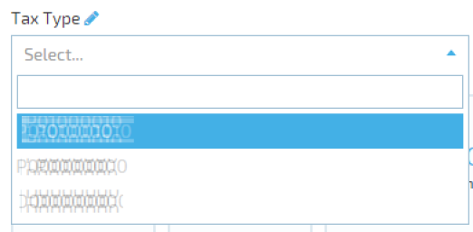

The general settings blade will be shown.   

* Click "Tax types" pen
  
* In the setting edit blade make changes you need.
  
* Click "Save" in the general settings blade menu to commit made changes.  
  

The new values should appear in the list of available tax codes.

### Assigning tax type to category/item

To assign tax code to an item navigate to it in Catalog module. Check it and click "Manage" in the menu or right-click the mouse on the item and select "Manage".

Find the "Tax type" property. Choose the appropriate tax code from the available values of codes. If you don't find the code you need, edit the tax codes setting values as described above and choose the right one.  

  
  
Click "Save" to commit made changes.  
  
  
If all items of the catalog category should have the same tax type. You can assign the tax type to the category. You can do this in the category properties management blade. That way all the items in the category and subcategories will have the tax code provided by the category if it wasn't set to the item directly. Navigate to the desired category. Check the category for which you need to apply tax code and click "Manage" button in the menu.  

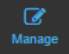  

In the category management view find "Tax type" and select the appropriate code or add one as described in the previous section.  

  

Click "Save" to commit made changes.

  

All items that didn't have any tax code assigned will get the tax code provided by the category they are in.

### Assigning tax type to shipping method

To assign tax code to shipping method navigate to Stores module. Select the store. Click "Shipping methods" widget.

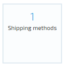

Select the shipping method for which tax code should be assigned.

Find the "Tax type" property. Choose the appropriate tax code from the available values of codes. If you don't find the code you need, edit the tax codes setting values as described above and choose the right one.  

Click "Ok" button in the Shipping method details blade.

  

Click "Save" in the Store details blade to commit made changes.  

### Adding Customer exemption number

VirtoCommerce provides the exemption number assignment using Customer properties.

* Add "Tax exempt" ShortText property to the customer you need.
* Provide the Exemption number as the value of the property.
* To add tax exemption property to customer navigate to "Customers" module.
* Choose the customer for which you need to provide the exemption number.
* Click "Properties" widget.
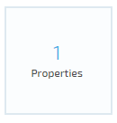
* In the "Properties" blade menu click "Add property".
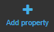
* In the property creation wizard blade give "Tax exempt" name to the property. Leave the value type ShortText.
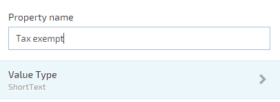
* Click "Ok" in the bottom of the wizard blade.

* Now in the property detail blade enter exemption certificate number as the value of the "Tax exempt" property.
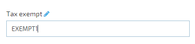
* Click "Ok" in the bottom of the properties details blade.

* Click "Save" in the Customer details blade to commit made changes.  

### Address validation

In order to validate customer address in the VirtoCommerce manager go to appropriate Customer account select address you need to verify and click "Validate address" button in the toolbar.

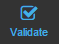

Depending on the response the resulting dialog will show the success

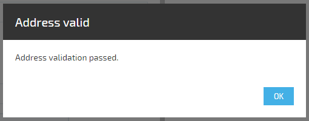

or failure message with the details.

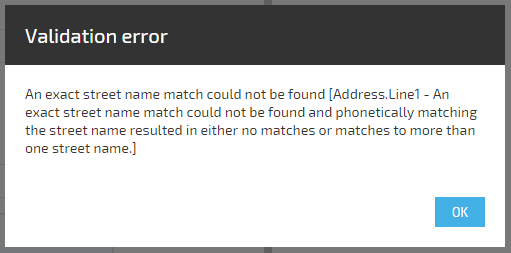

Address validation is not a requirement. You can still save the address if it is not valid as not all existing addresses are in AvaTax provided database. But it's a good place to check if address values are entered correctly.

### Enable/Disable address validation

You can enable/disable the avalara address validation by the switch in the settings blade of the module.

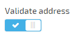
