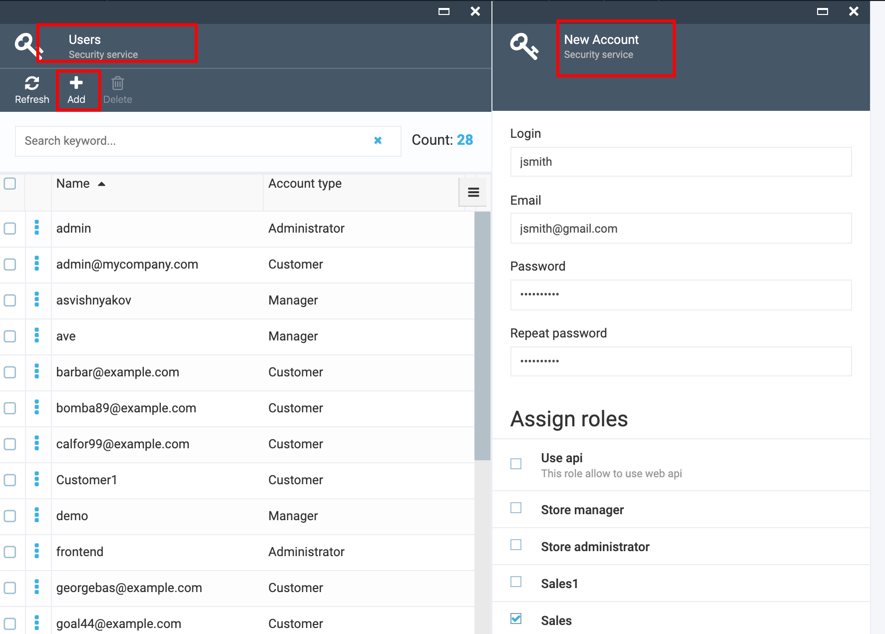
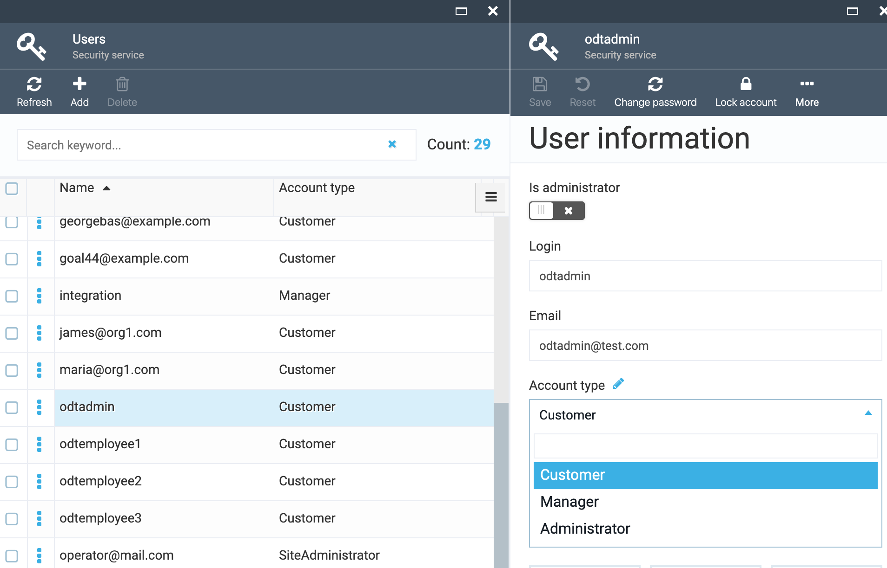
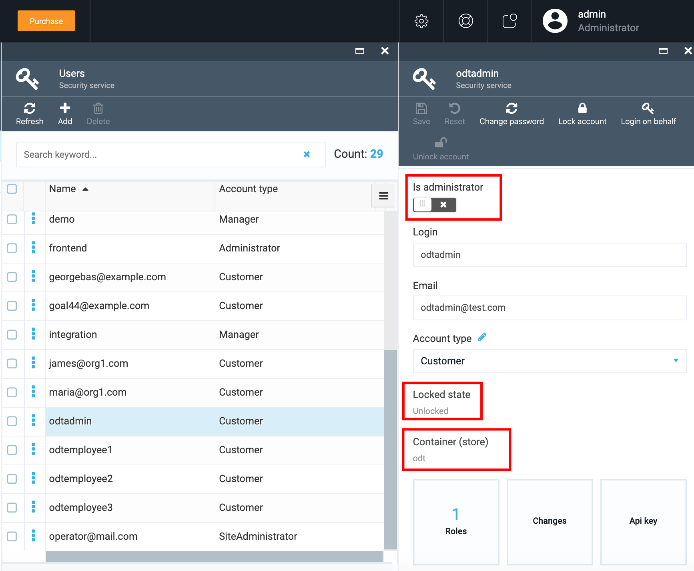
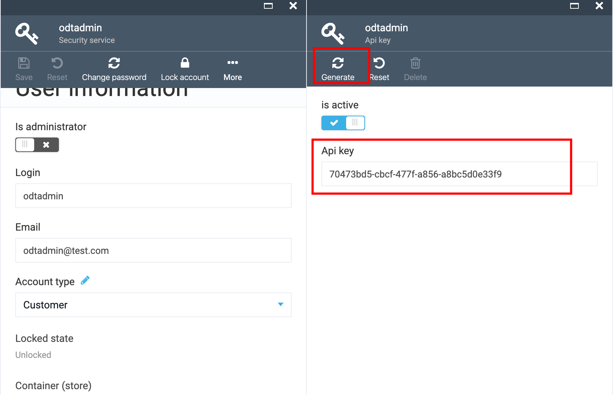
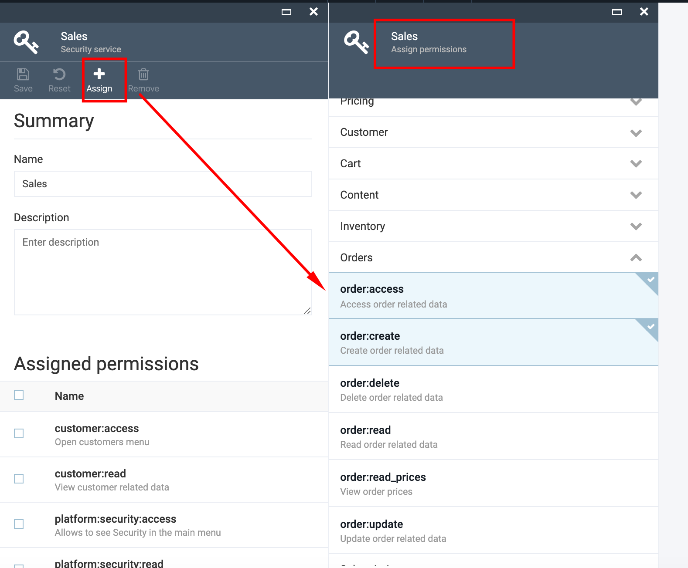
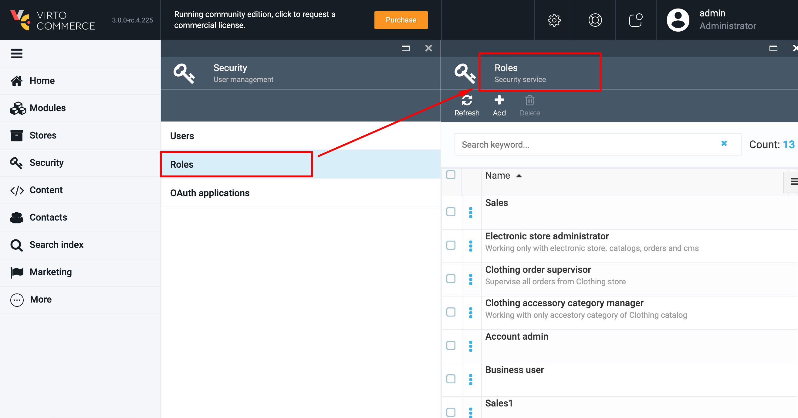
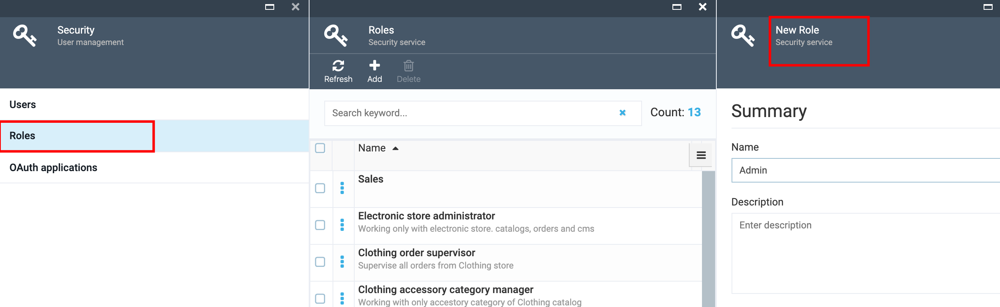
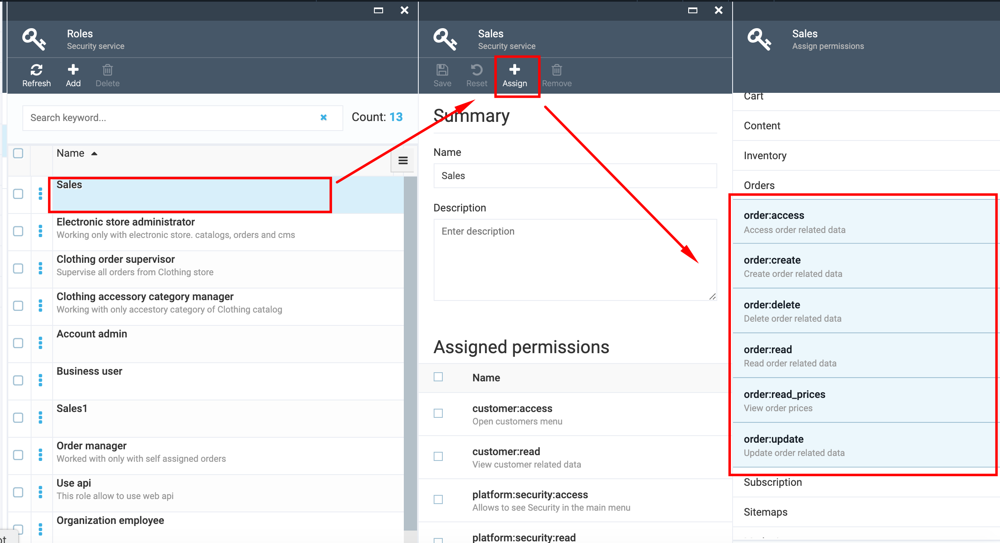
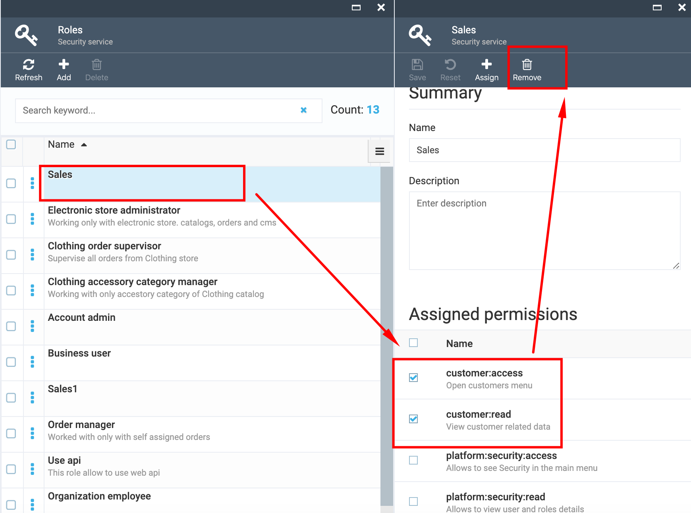

# Security

## Overview

### Role based security

Role-based security allows Virtocommerce administrators to group users into roles for security purposes. Each role can be defined with specific granular permissions to allow access to different functionality within the software.

Security system is composed of three main entities

1. Permissions is a basic unit in security system. It describes particular right of action and has a string presentation which is used in permission checks. For [example](https://github.com/VirtoCommerce/vc-module-order/blob/1079a4b308a42e6d0bec71fa545ed7bee911a9ed/src/VirtoCommerce.OrdersModule.Core/ModuleConstants.cs#L10), orders:read, customer:access, customer:read, etc.

1. Roles are used to collect permissions that define a particular function within the platform, according to a particular scope. Roles can grant permissions to various functions within platform. A role is basically just a collection of permissions. Users that are assigned to the role will inherit these permissions.

1. Scopes are used to restrict permissions to concrete conditions or objects.

### Bounded scope

Used in situation when you need to restrict user access to particular objects (manually selected or selected by condition). For example: Restrict access to the specified stores or allow update orders only by responsible users.

### Users

Users are individuals working with **Virto Commerce** management application and services.

In order to manage **Virto Commerce** functionality each user must be assigned to at least one role. Each role provides the user with certain access permissions.These permissions allow or restrict the user's access to functionalities within the **Virto Commerce** client application.

Common Roles are provided by default with each Virto Commerce installation. User roles can be created or edited to provide their staff with permissions reflecting only the tasks they perform within the **Virto Commerce** management application.

After installation, there is one user in the system with Super User (administrator) privileges. Only administrator users have permission to manage users and roles.

### Roles and Permissions

Permissions are controlled by assigning Roles to users. A Role is a collection of permissions. A Role can be assigned to multiple users. Each user can have more than one assigned Role.

### Scenarios

#### Create User Account

1. Go to More->Security->Users and click 'Add';
1. In the opened 'New Account' blade fill out the fields:
     1. Login;
     1. Email (optional);
     1. Password;
     1. Repeat password;
1. Click the 'Create' button;
1. The new account will be created.

#### Specify Account Type

1. Open the created user account
1. Under 'Account type select one of the options from the drop down:
     1. Admin
     1. Manager
     1. Customer
1. Save the changes

**Important**:

1. If you select 'Customer' account type, the user will not have access to the VC admin side at all.
1. If 'Manager' account type is selected, the user will be able to login to VC admin side, but will see only a blank interface, unless he was given specific permissions.
1. The 'Admin' account type gives the user access to VC admin.

#### 'User Information' blade description

1. 'Is Administrator' check box:
     1. If checked allows access to the entire system.
     1. For security reasons no more than  one account within the Organization should be given this permission.

1. Locked state (not editable):
     1. Shows if the account is locked or unlocked.
     1. The account can be locked either on Storefront or in VC admin by clicking the 'Lock account' button in the menu bar.
     1. Possibility to unlock the locked account by clicking the 'Unlock account' button placed in the menu bar.
1. Container store (not editable):
     1. Container property is defined via API.
     1. Defines the stores in which the account was created and to which the account has access.

#### Assign Role to Account

1. Open user's account and click on the 'Roles' widget;
1. On 'Manage roles' blade click 'Assign';
1. Select the role to assign and click the 'OK' button;
1. Save the changes;
1. The new role will appear in user's account.

### Generate API key

The API key should be linked to the security account.

**Important!**

1. If the API key was de-activated, the system will not allow the API call using the old key;
1. If the API key was de-activated and then re-activated, the system will not allow use the old key. A new API key will be generated.

To generate an API key, you should go through the following steps:

1. Open the security account;
1. Select the API key widget;
1. Click the 'Generate' button in the menu bar;
1. Activate the key by switching on the 'Is Active' button.

#### Assign permissions

1. Open the user's account and select 'Roles';
1. On 'Manage roles' blade select the role to which the permissions should be assigned;
1. On 'Roles details' blade click 'Assign';
1. Select the permissions to assign to the selected role and save the changes;
1. The selected permissions will be assigned to the role.

#### Create New Role

1. Go to More->Security->Roles and click 'Add';
1. Enter the Role name;
1. Enter the Role description if needed;
1. Click 'Create';
1. The new Role will be created and displayed on the 'Roles' blade.

#### Assign Permissions to Role

1. Select the Role on 'Roles' blade and click 'Assign';
1. Select permissions to assign to the role;
1. Click 'OK';
1. Save the changes;
1. The selected permissions will be assigned to the role.

#### Remove Assigned Permissions

1. Select the Role on 'Roles' blade;
1. Under 'Assigned Permissions' check the permissions you want to remove from the selected role;
1. Click 'Remove' and save the changes;
1. The permissions will be removed from the role.

## Documentation

[Make secure Web API for Platform 3.0](https://community.virtocommerce.com/t/make-secure-web-api-for-platform-3-0/105)
