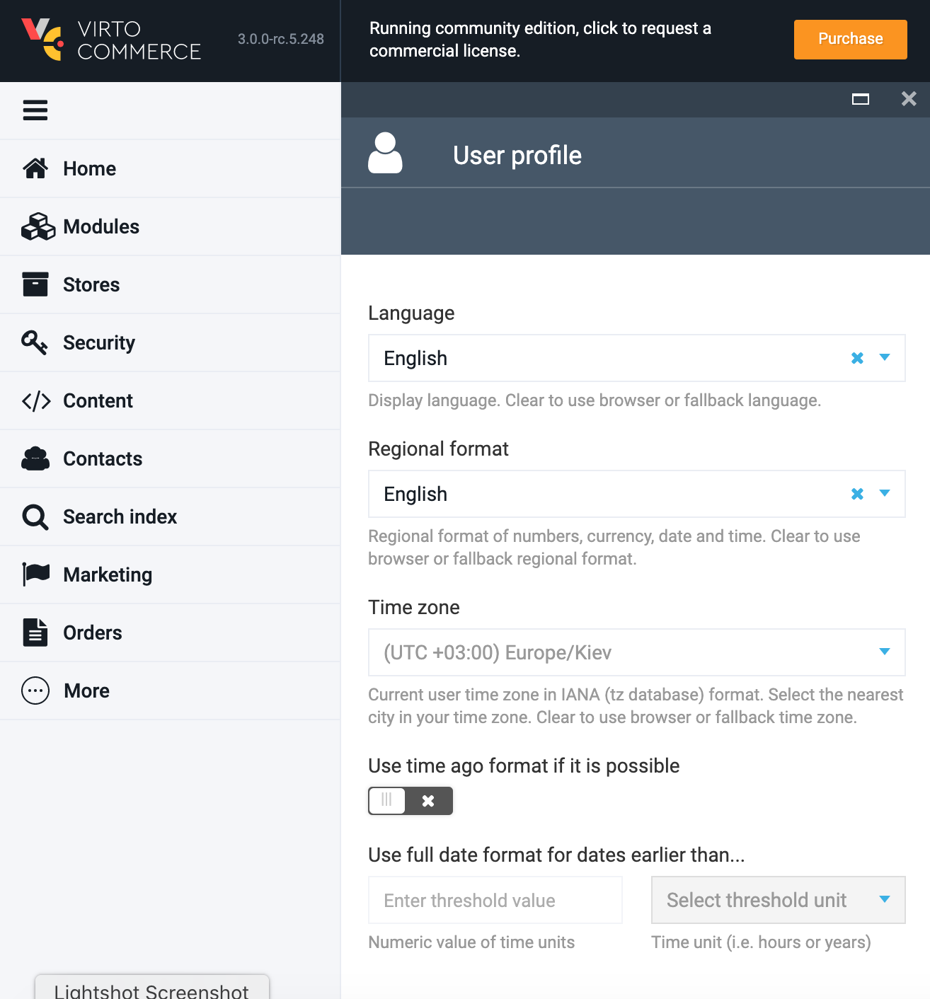
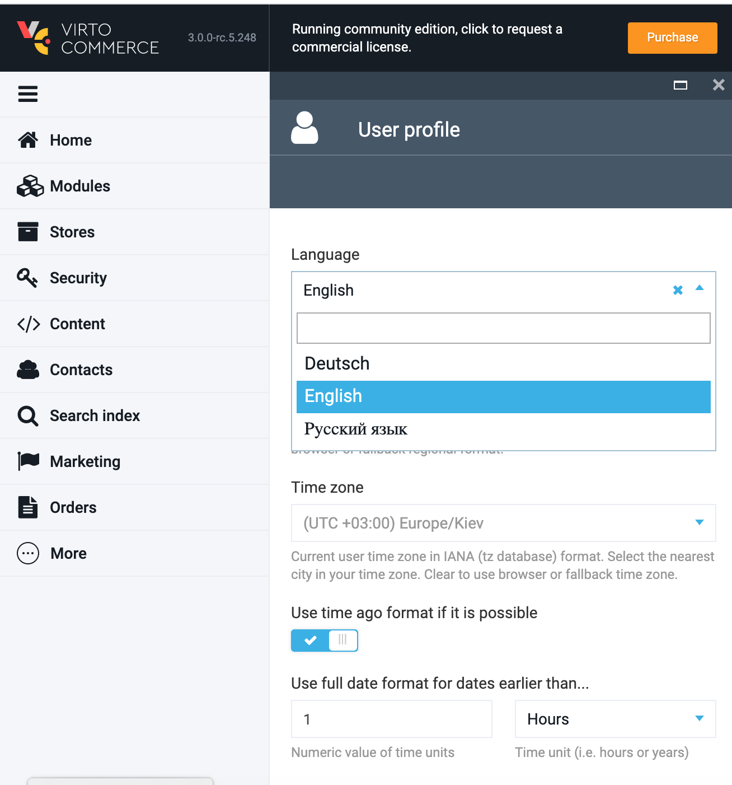
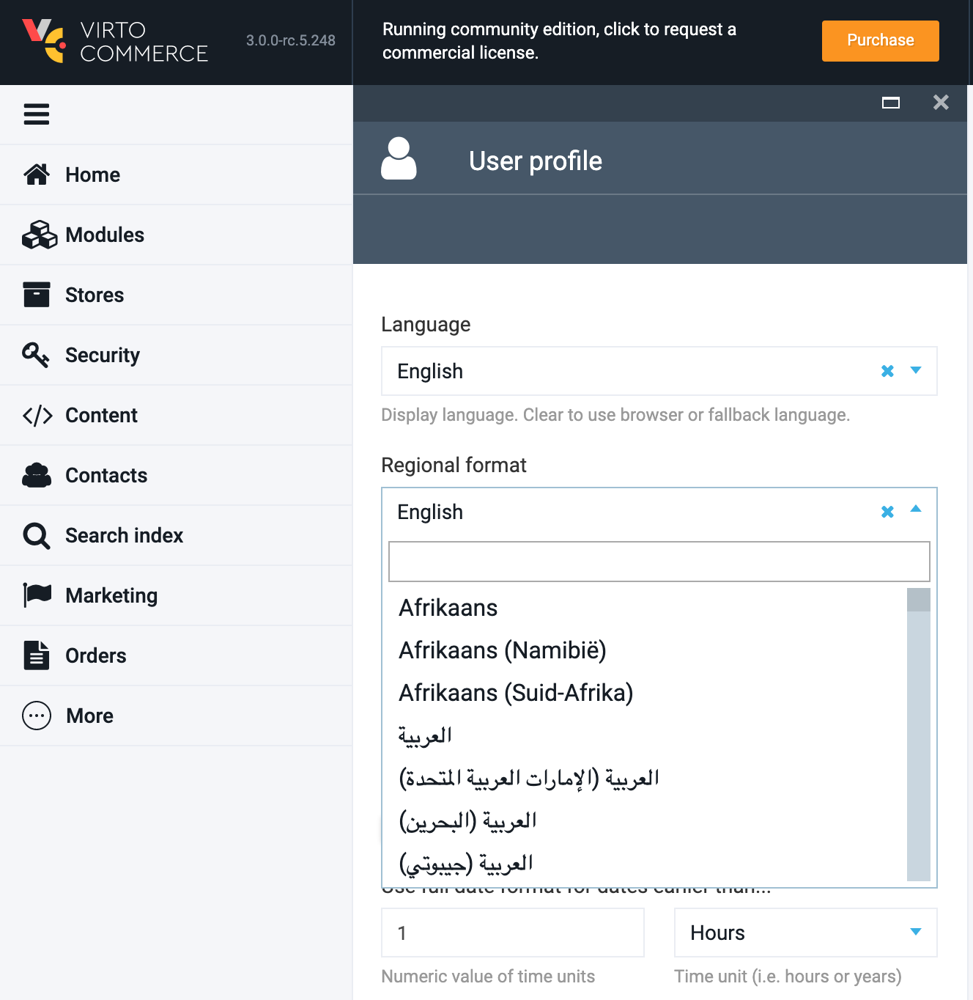
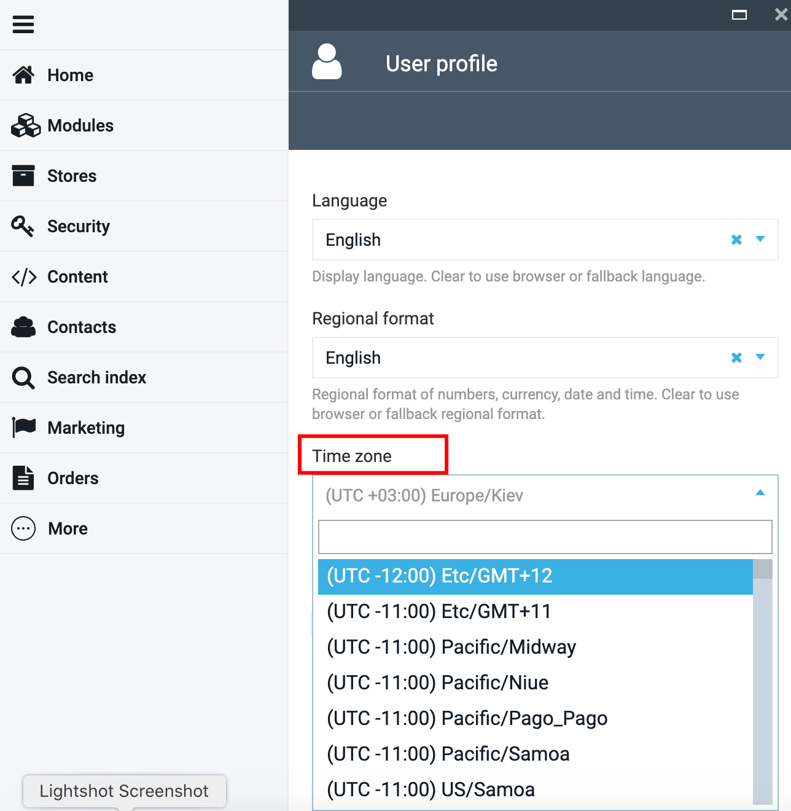
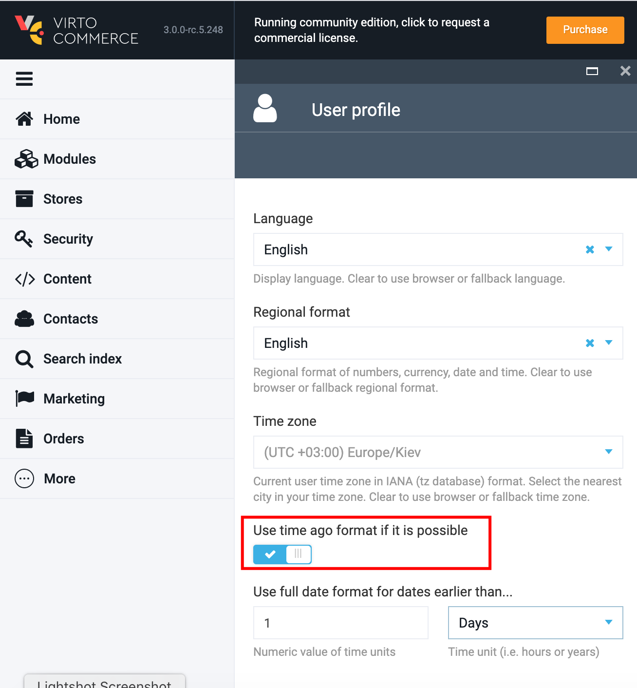

# User Profile

User Profile module helps define the admin interface. The admin can specify the language, regional format, time zone and the time format of the updates.

## Edit User Profile

1. Go to More->User Profile

1. Select the language from the drop down. the selected language will be displayed on your VC admin;

1. Select the regional format you need from the corresponding drop down;

1. Specify the time zone;

1. Specify the 'Time ago' format if needed to display when the updates were last done in VC admin;
1. If switched on, then select the time unit and specify the numeric value of the time unit.

