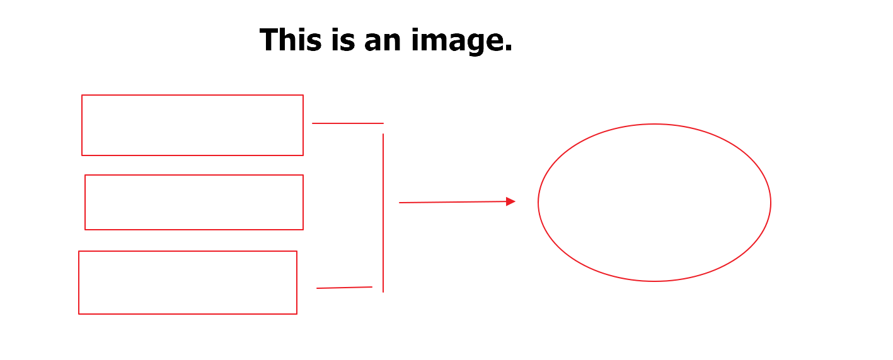

# This Is Heading 1
This is some text below Heading 1.

Lorem ipsum dolor sit amet, consectetur adipiscing elit, sed do eiusmod tempor incididunt ut labore et dolore magna aliqua. Ut enim ad minim veniam, quis nostrud exercitation ullamco laboris nisi ut aliquip ex ea commodo consequat.

Each text may also have unnumbered lists:

+ Lorem ipsum dolor sit amet, consectetur adipiscing elit
+ Sed do eiusmod tempor incididunt ut labore et dolore magna aliqua
+ Ut enim ad minim veniam, quis nostrud exercitation ullamco laboris nisi ut aliquip ex ea commodo consequat

As well as numbered lists:

1. Duis aute irure dolor in reprehenderit in voluptate velit esse
2. Cillum dolore eu fugiat nulla pariatur
3. Excepteur sint occaecat cupidatat non proident

## This is Heading 2
This is some text below Heading 2.

Lorem ipsum dolor sit amet, consectetur adipiscing elit, sed do eiusmod tempor incididunt ut labore et dolore magna aliqua. Ut enim ad minim veniam, quis nostrud exercitation ullamco laboris nisi ut aliquip ex ea commodo consequat.

Below the text, we may have an image, which usually is either a chart or a screen capture:

*Figure 1: This is the image caption. I need a dedicated style for image captions as well (usually, it is a text with smaller font, aligned at center, sometimes italicized)*

We may also have tables, like this:

|Version|Subversion|Type|
|-|-|-|
|Windows 11|21H2|x64, Arm64|
|Windows 10 Client|1607+|x64, x86, Arm64|
|Windows Client|7 SP1+, 8.1|x64, x86|
|Windows Server|2012+|x64, x86|
|Windows Server Core|2012+|x64, x86|
|Nano Server|1809+|x64|

### This is Heading 3
This is some text below Heading 3.

For notes, we only have this blockquote as of now:
> ***Note:*** Please do not litter.

I would like to transform it into three types of information messages:

+ Info/tip: Gray-backgrounded block with an ''i'' icon
+ Warning: Yellow-backgrounded block with a yellow exclamation triangle icon
+ Error: Red-backgrounded block with a red exclamation triangle icon

#### In some very few cases, we may also have Heading 4
This is some text below Heading 4.

We also need special formatting design for commands/runnable objects, both `within the text` and on a separate line:

`1dotnet tool install -g VirtoCommerce.GlobalTool`

Finally, we need to format pieces of code, like this:

```cs
1 public sealed class CsvProductImageWriter : IImportDataWriter
2    {
3        private readonly bool _debug;
4        public CsvProductImageWriter(ImportContext context)
5        {
6            _debug = Convert.ToBoolean(context.ImportProfile.Settings.FirstOrDefault(x => x.Name == ProductImageImporterSettings.DebugSetting.Name)?.Value ?? false);
7        }
8        public Task WriteAsync(object[] items, ImportContext context)
9        {
10            var index = 0;
11            try
12            {
13                foreach (var image in items.OfType<ProductImage>())
14                {
15                    var line = context.ProgressInfo.ProcessedCount + index;
16                    //TODO: Add code for adding image to product
17                   if (_debug)
18                    {
19                        Debug.WriteLine($"Line {line}: {image.ImageUrl} is added to product #{image.ProductId}");
20                    }
21                    index++;
22                }
23            }
24            catch (Exception ex)
25            {
26                var errorInfo = new ErrorInfo
27                {
28                    ErrorLine = context.ProgressInfo.ProcessedCount + index,
29                    ErrorMessage = ex.Message,
30                };
31                context.ErrorCallback(errorInfo);
32            }
33            return Task.CompletedTask;
34        }
35
36        public void Dispose()
37        {
38            //nothing to dispose
39        }
40    }
```
