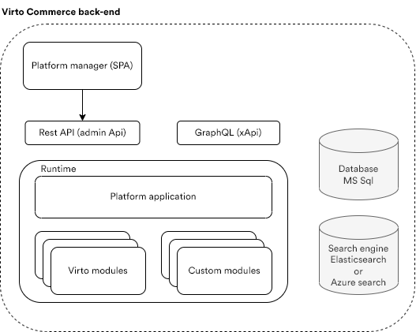

# Conceptual Overview

This section is an overview of all components in the Virto Commerce platform application.

The chart below shows the high level architecture of the platform:

The Virto Commerce platform's core components are Platform Manager (SPA), Platform Application (runtime), Modules, and REST and GraphQL APIs. You can find a brief description of each below:

-   _Platform manager (SPA)_: A web-based user interface packed into an SPA allowing you to manage your application. It also provides back office capabilities that enable master data management, configuring products, prices, inventories, employees, workflows, and other functionality required for ecommerce applications. It works with all data through REST API the platform runtime provides. _(TBA: link to Platform manager(legacy))_
    
-   _Platform application (runtime)_: An [ASP.](http://asp.net/ "http://ASP.nET")NET Core application that bootstraps the modules and manager GUI and acts as a host for all platform capabilities.
    
-   _Modules_: Each module encapsulates a portion of the application's overall functionality. Multiple modules get organized into independent and interchangeable software packages hosted by the Platform Application _(TBA: link to Fundamentals/Modularity)._ All modules can be divided to three main categories depending on which tasks they target:
    
	o Business modules: Contain the implementation of business functionality;
    
	o Integration modules: Implement various kinds of integration with third party services;
    
	o Custom solution modules: Usually contain an extension of the existing logic other modules have.
    
-   REST and GraphQL API: A set of APIs used to manage resources. REST API _(TBA: link to Rest API reference)_ is mainly used to build integration and interact with Virto resources, while GraphQL represents an implementation of the Back End for Front End design pattern and provides a lightweight access to ecommerce capabilities for various storefront applications. _(TBA: link to XApi reference)_
