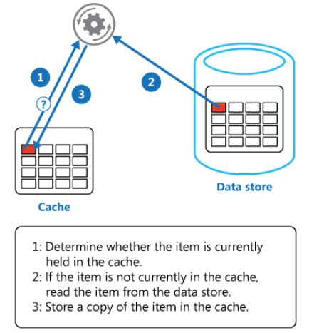

# Overview

Caching is one of the most effective ways to improve website performance. We at Virto Commerce have so far used a few various ways to cache application data to reduce the load on the external services and database, and minimize the application latency when handling API requests. In this article, we will describe the technical details and the best caching practices we employ in our platform.

## Cache-Aside Pattern Overview

We opted for [Cache-Aside](https://docs.microsoft.com/en-us/azure/architecture/patterns/cache-aside) as the main pattern for all caching logic, since it is very simple and straightforward for implementation and testing.

The pattern enables applications to load data on demand:



When we need specific data, we first try to get it from the cache. If the data is not in the cache, we get it from the source, add it to the cache, and return it. Next time, this data will be returned from the cache. This pattern improves performance and also helps maintain consistency between the data held in the cache and data in the underlying storage.

## Memory vs Distributed Cache

We do not use distributed cache in the platform code, because we want to keep the platform configuration flexible and simple and prefer to solve potential scalability issues by other means (see _Scaling_ below).

There are three additional cons of using distributed cache that influenced our decision:

-   All cached data must support serialization and deserialization, which is not always possible with distributed cache.
    
-   Compared to memory cache, distributed cache has somewhat worse performance due to network latency.
    
-   Using both memory and distributed cache leads to complexity.
    

## Cache-Aside Basic Implementation

For platform cache, we experimented with [IMemoryCache](https://docs.microsoft.com/en-us/aspnet/core/performance/caching/memory?view=aspnetcore-3.1) that stores cached data within the memory.

A simple Cache-Aside pattern implementation using IMemoryCache looks like this:

``` json
1 public object GetDataById(string objectId)
2 {
3    object data;
4    if (!this._memoryCache.TryGetValue($"cache-key-{objectId}", out data))
5    {
6        data = this.GetObjectFromDatabase(objectId);
7        this._memoryCache.Set($"cache-key-{objectId}", data, new TimeSpan(0, 5, 0));
8    }
9    return data;
10 }
```

This code has a few disadvantages:

-   It contains too many lines and must be simplified.
    
-   It requires manual creation of the cache key, which cannot guarantee its uniqueness.
    
-   It does not protect against race conditions when multiple streams will try to access the same cache key simultaneously, which may lead to excess data eviction. This may not be an issue, unless your application has a high concurrent load and costly back end requests, or the back end is not designed to handle simultaneous requests.
    
-   It assumes you would be manually controlling the cached data lifetime. Choosing proper values for the lifetime is a complicated task and reduces developer's productivity.    

With the relatively new MemoryCache methods, `GetOrCreate` and `GetOrCreateAsync`, the above issues are here to stay, which means one cannot use them on an as-is basis either. To see the bigger picture and learn more about the `GetOrCreate` method, you can refer to [this article](https://blog.novanet.no/asp-net-core-memory-cache-is-get-or-create-thread-safe/).

# What We Did to Improve Code

To solve the issues we mentioned above, we defined our own [IMemoryCacheExtensions](https://github.com/VirtoCommerce/vc-platform/blob/master/src/VirtoCommerce.Platform.Core/Caching/MemoryCacheExtensions.cs). This implementation ensures that cached delegates (cache misses) are called only once, even if multiple threads are accessing the cache concurrently under race conditions. In addition, this extension provides a more compact syntax for the client code.

Here is a variation of the previous code example with a new extension:

```json
1  public object GetDataById(string objectId)
2  {
3      object data;
4      var cacheKey = CacheKey.With(GetType(), nameof(GetDataById), id);
5      var data = _memoryCache.GetOrCreateExclusive(cacheKey, cacheEntry =>
6          {
7            cacheEntry.AddExpirationToken(MyCacheRegion.CreateChangeToken()); 
8            return this.GetObjectFromDatabase(objectId);
9          });
10      return data;
11 }
```

Now, some notes to the code:

**Line 4: Cache key generation.** A special static class, `CacheKey`, provides a method for unique string cache key generation according to the arguments and type and method of the information being transferred.

Here is an example:

```
 CacheKey.With(GetType(), nameof(GetDataById), "123"); /* => "TypeName:GetDataById-123" */

```

`CacheKey` can also be used to generate cache keys for complex object types. Most of the platform types are derived from the `Entity` or `ValueObject` classes, each of those implementing the `ICacheKey` interface that contains the `GetCacheKey()` method, which can be used for cache key generation.

The following code sample shows how to create a cache key for a complex object type:

```json
1 class ComplexValueObject : ValueObject
2 {
3    public string Prop1 { get; set; }
4    public string Prop2 { get; set; }
5 }
6
7 var valueObj = new ComplexValueObject { Prop1 = "Prop1Value", Prop2 = "Prop2Value" };
8 var data = CacheKey.With(valueObj.GetCacheKey());
10 //cacheKey will take the "Prop1Value-Prop2Value" value
```

**Line 5: Thread-safe caching and avoiding race conditions.** The `_memoryCache.GetOrCreateExclusive()` method calls a thread-safe caching extension that guarantees that the cacheable delegate (cache miss) should run only once in a multiple thread race.

An asynchronous version of this extension method, `_memoryCache.GetOrCreateExclusiveAsync()`, is also available.

The following code sample shows how this exclusive access to the cacheable delegate works:

```json
1 public void GetOrCreateExclusive()
2        {
3            var sut = new MemoryCache();
4            int counter = 0;
5            Parallel.ForEach(Enumerable.Range(1, 10), i =>
6            {
7               var item = sut.GetOrCreateExclusive("test-key", cacheEntry =>
8                {
9                    cacheEntry.SlidingExpiration = TimeSpan.FromSeconds(10);
10                    return Interlocked.Increment(ref counter);
11                });
12               Console.Write($"{item} ");
13            });
14        }
```

This will output the following:

```
1 1 1 1 1 1 1 1 1 1
```

**Line 7: Cache expiration and eviction.** We get a `CancellationTokenSource` object that is associated with the cache data and a strongly typed cache region, which allows multiple cache entries to be evicted as a group (see [ASP.NET Core Memory Cache Dependencies](https://docs.microsoft.com/en-us/aspnet/core/performance/caching/memory?view=aspnetcore-3.1#cache-dependencies)).

> Important: We intentionally disable the inheritance for cached entry expiration tokens and time-based expiration settings. When one cache entry is used to create another, the child copies the parent entry expiration settings and cannot get expired by manually removing or updating the parent entry. This leads to unpredictable side effects, and it is hard to maintain and debug such cache dependencies.

We avoid manual control of the cached data lifetime in our code. The platform has a special `CachingOptions` object that contains the settings for **Absolute** or **Sliding** lifetimes for all cached data (see below).

Thanks to the _Clean Architecture_ and the _Bounded_ contexts, where each boundary controls all read and change operations for the data belonging to the domain, we can always keep the cache updated and evict modified data from it explicitly.

## Strongly Typed Cache Regions

The platform supports a construct called _strongly typed cache regions_ that is used to control a set of cache keys and provides the tools to evict grouped or related data from the cache to keep the latter consistent. To define your own cache region, you need to derive it from `CancellableCacheRegion<>`. Then, the `ExpireRegion` method can be used to remove all keys within a single region:

```json
1  //Region definition
2  public static class MyCacheRegion : CancellableCacheRegion<MyCacheRegion>
3  {    
4  }
5
6  //Usage
7  cacheEntry.AddExpirationToken(MyCacheRegion.CreateChangeToken()); 
8
9  //Expire all data associated with the region
10 MyCacheRegion.ExpireRegion();
```

There is also a special `GlobalCacheRegion` that can be used to expire all cached data of the entire application:

```json
1 //Expire all cached data for entire application
2 GlobalCacheRegion.ExpireRegion();
```

## Caching Null Values

By default, the platform caches null values. If you opt for negative caching, this default behavior can be changed by providing the `false` value to `cacheNullValue` in the `GetOrCreateExclusive` method, e.g.:

```json
 var data = _memoryCache.GetOrCreateExclusive(cacheKey, cacheEntry => {}, cacheNullValue: false);
```

## Cache Settings

To learn how to configure cache settings, see: <TODO: Link to cache settings>.

## Scaling

Running multiple platform instances, each with its own local cache, and which in turn must be consistent with the cache of other instances, can be challenging. Without solving this problem, each instance of the application will have inconsistent data, which will definitely dissatisfy Virto Commerce customers.

[This article by Virto Commerce](https://docs.virtocommerce.org/techniques/how-scale-out-platform-on-azure/) will explain to you how to configure Redis service as a cache backplane to sync local cache for multiple platform instances.

# Summary
To wrap it up, here are some rules to follow and notes to consider:
 
-   We only use in-memory cache by default (neither distributed nor mixed).
    
-   When performing platform scale out configuration, you need to have a Redis server configured as a backplane to sync cached data in memory for multiple platform instances in a consistent state. <TODO: add link>
    
-   The [IMemoryCacheExtensions](https://github.com/VirtoCommerce/vc-platform/blob/master/src/VirtoCommerce.Platform.Core/Caching/MemoryCacheExtensions.cs) extension contains sync and async extension methods that represent a compact version of the Cache-Aside pattern implementation based on the ASP.NET Core IMemoryCache interface and provide exclusive access to the original data under race conditions.
    
-   In order to avoid issues with stale cached data, always keep your cached data in a consistent state using the strongly typed cache regions that enable evicting groups of data.
    
-   The platform uses an aggressive caching policy for most DAL services, even when caching large search results. Do not use relative size metrics for cached data, as it may lead to high memory utilization in some production scenarios. Play with the `CacheSlidingExpiration` and `CacheAbsoluteExpiration` values to find an optimal balance of memory consumption and application performance.

## Additional resources
To learn more about the things covered by this article, you might also want to check out these sources:

-   [Caching in ASP.NET by Microsoft](https://docs.microsoft.com/en-us/aspnet/core/performance/caching/memory?view=aspnetcore-6.0)
    
-   [Caching in Azure by Microsoft](https://docs.microsoft.com/en-us/azure/architecture/patterns/cache-aside)
    
-   [Cache Configuration by Virto Commerce](link-to-cache-configuration)
