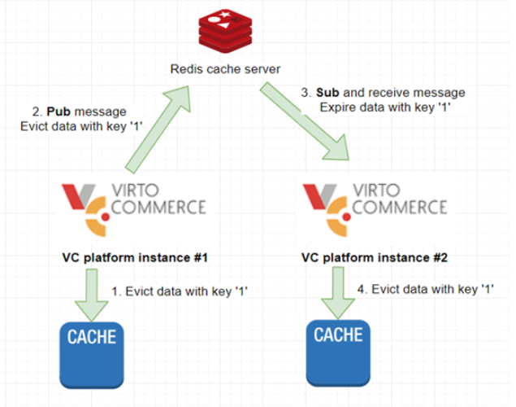

# Setting up Redis Backplane for Scaling out
Running multiple instances of your application, all accessing the same distributed cache, can be tricky. This article explains how and when you should use the cache backplane feature provided by Virto Commerce.

## Multi Level Caching
Keeping the cached data in a consistent state is quite simple if you have a single instance application with a local cache storage. You can then easily control cache lifecycle and invalidation when entries are removed or deleted.

It is, however, a totally different story when it comes to a scaled out application with multiple instances. The core issue here is how the instances would find out when the data was changed and the local cache data becomes irrelevant.

Using distributed cache may be an option; nonetheless, we do not use distributed cache with the Virto platform because the network latency for the cached data degrades performance. Besides, such configuration would require serialization and deserialization support for all cached data, which is also hard to achieve. The point is to use local cache storage for each application instance, all of those being connected to the shared broadcasted service (backplane) and data through receiving invalidation messages.

To resolve this task, we need a service, which all application instances would be connected to and which can broadcast messages when cache data becomes invalid. Redis may come in quite handy here, as it is an in-memory key-value storage that supports a messaging system with the publish/subscribe model. Virto's memory caching Redis backplane uses the pub/sub feature to forward messages to other servers. When one platform instance evicts some data from cache, the message for this event is transferred to the backplane. The backplane knows all connected clients and which servers they are on, and sends a message to all clients via their respective servers.

The chart below shows how it all works:



## Implementing Cache Backplane Using Redis Pub/Sub Channel

Redis Pub/Sub is used to send messages to the Redis server on any key change, clear cache, clear region, or remove key operation. Every cache instance with the same configuration gets subscribed to the same channel and can react on those messages to keep other cache handles in sync with the master.

You can add a Redis cache backplane to the Virto platform at the stage of its configuration by copying the primary connection string (`StackExchange.Redis`) to [Configuration](https://docs.microsoft.com/en-us/aspnet/core/fundamentals/configuration/?view=aspnetcore-6.0):
    
    -   For local deployment: Save the connection string with [Secret Manager](https://docs.microsoft.com/en-us/aspnet/core/security/app-secrets?view=aspnetcore-6.0#secret-manager) or `appsetting.json`.
        
    -   For Azure based instance: Save the connection string in App Service Configuration or another secure storage.

The following example shows you how to set up the Redis backplane for memory cache in `appsettings.json`:

`appsettings.json`

```json
1 "ConnectionStrings": {
2         ...
3         //Add RedisConnectionString value to start using Redis server as backplane for memory cache synchronization
4        "RedisConnectionString": "vc.redis.cache.windows.net:6380,password={password}=,ssl=True,abortConnect=False"
5        ...
6    },
```

> Note: You will have to use the same `RedisConnectionString` for all platform instances, the local cache instances of which must also be synchronized.

### How It Works

The backplane works with messages. Every time an item gets removed or updated, the platform will send a message to the backplane storing the information needed to update other clients. All other clients will receive those messages asynchronously and will react accordingly.

When, for example, an item gets removed by one client, the other client has to remove the same item from all other cache handles but the source (because it was already removed). For the remove operations, this is not that important. Let's assume, however, that a cache item was updated by Client A, while Client B still has the old version in its local in-process cache. With the source being set, the platform can evict the item from all Client B's local in-process cache instances and, upon the next _Get the new version_ request, will retrieve new version from the source.

That being said, because of the network traffic generated and the overhead that occurs, the performance of the cache will  slightly go down. Besides, the synchronization will not happen on all clients at the same time, which might lead to some delays,  although very small ones.

## Additional Resources
For those who want more information on the topic in question, here is a couple of useful links to start with:

-   [Redis Overview](https://redis.io/)
    
-   [How to Scale out Platform Based on Azure ](https://docs.virtocommerce.org/techniques/how-scale-out-platform-on-azure/)
