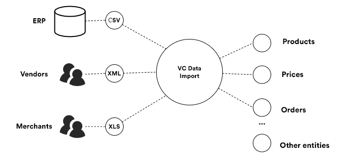
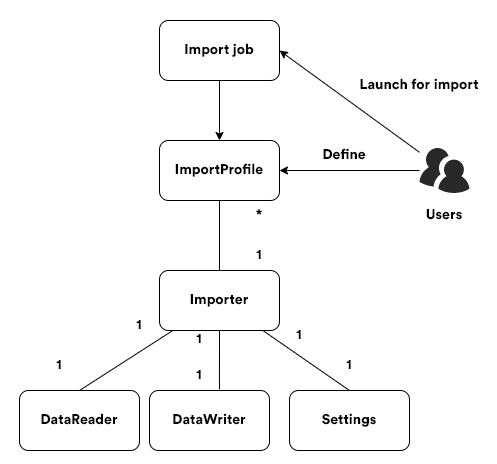

# Main Concept
This article explains the architecture and behavior of Virto Commerce Import Framework, which allows you to easily import your data, such as product information, customers, categories, and much more, into the Virto Commerce platform.

## Overview
_VC Data Import_ allows you to define what kind of data you want to import into your application using custom configurable _Import profiles_ where one determines what types of data to import and from which data sources.

When using VC Data Import, you can leverage its key advantages:

-   Manage user defined import profiles directly from the platform manager UI
    
-   See the import history with detailed logs
    
-   Work with an extensibility model that enables extending the existing built-in importers with new data types and sources

## Core Structure
The chart below shows VC Data Import's high level logical structure:

As you can clearly see, VC Data Import is based on three main objects:

-   _Import job_: An object for a task that imports data according to _ImportProfile_; you can run it both manually on-demand or regularly based on a schedule.

-   _Import profile_: A user-defined entity with a unique name acting as its ID. Each profile must be associated with a certain _Importer_ and also can be configured through the runtime parameters in _Settings_ that _Importer_ might provide.
    
-   _Importer_: A piece of code that reads data from a specific data source file (CSV, XLS, etc.) and writes an object of a specific data type (products, prices, etc.) to the target system. Each _Importer_ consists of the three main objects:
    
    -   _DataReader_, which reads data from a file (CSV, XSLS, YML, etc.) or another type of external source (a database, a web service, etc.);
        
    -   _DataWriter_ that writes the imported objects into the system; and
        
    -   _Settings_, which provides settings that can be used to configure _ImportProfile_ linked to the importer in question.
        

> ***Note:*** *You can also create your own data importers, which we explain [here](https://virtocommerce.atlassian.net/browse/PD-35 "LINK_TO_CREATING_DATA_IMPORTERS").
