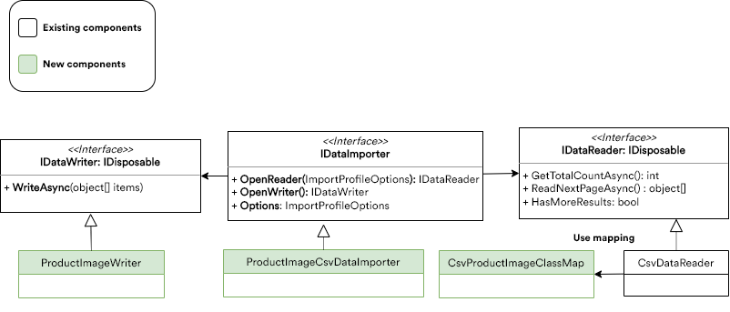

# Building Custom Data Importer -- In Progress

This section will guide you through building your own data importer of a specific type. All steps described below are based on a real example of importing product images from a CSV file.

> ***Note:*** *Currently, we only support CSV for out-of-the-box import. You can, however, create your own file reader if you want to use a different format.*

Link to source code - TBA

## Prerequisites

Before you start creating your custom data importer, you need to check which components it should include. The chart below shows the essential components that need to be implemented into a new importer:



Let's assume you have a CSV file to import your data from with two columns: `productId` and `img_url`. To enable importing multiple images per single product, you will need to use multiple rows with the same product ID.

Now that you know which data your import file should include, you can proceed with the first step of creating a data importer.

Since only the _.csv_ format is currently supported for out-of-the-box import, you either need to create a _.csv_ file in any preferred editor or can use this sample:

```csv
productId, img_url
1, https://i.picsum.photos/id/537/200/300.jpg?hmac=LG3kZs5AdrMmsgeVOdrfP0C5KT3WmP-q5TauEZdR4vk
1, https://i.picsum.photos/id/514/200/300.jpg?hmac=2SFAKrM0w5MkU7I_tQM9mq1m6POUDSPrTYu5tb5Sqlg
```

## Custom CSV Mapping to Use with Default CsvDataReader

Since we are going to use built-in _CsvDataReader_ to read the data from the CSV file, and it uses the [CsvHelper](https://joshclose.github.io/CsvHelper/) library for read and parse data, we do not need to define any new custom reader. Rather than that, we will define `ClassMap` (read more [here](https://joshclose.github.io/CsvHelper/examples/configuration/class-maps/)).

For that purpose, you need to create a new file, `CsvProductImageClassMap`, with the following content:

`CsvProductImageClassMap.cs`
```cs
1 public class CsvProductImageClassMap : ClassMap<ProductImage>
2    {
3        public CsvProductImageClassMap()
4        {
5            Map(m => m.ProductId);
6            Map(m => m.ImageUrl);
7        }
8    }
```

This will map the class properties to the column headers of the CSV file. This example is identical to not using any class mapping at all when the headers match the property names.

## Defining Settings for Custom Importer

Each importer might provide a set of settings that can be changed by user for any certain import profile instance. At this stage, we actually define the settings that will be used by our importer in the `ProductImageImporterSettings.cs` file:

`ProductImageImporterSettings.cs`
```cs
1 public class ProductImageImporterSettings
2    {
3        public static SettingDescriptor DebugSetting { get; } = new SettingDescriptor
4        {
5            Name = "Vcmp.Import.ProductImage.Debug",
6            ValueType = SettingValueType.Boolean,
7            GroupName = "Import",
8            DefaultValue = false
9        };
10
11        public static IEnumerable<SettingDescriptor> AllSettings
12        {
13            get
14            {
15                yield return DebugSetting;
16            }
17        }
18    }
```

## Creating DataWriter

At this step, we will create a new class, naming it _CsvProductImageWriter_, with the following content:

`CsvProductImageWriter.cs`
```cs
1 public sealed class CsvProductImageWriter : IImportDataWriter
2    {
3        private readonly bool _debug;
4        public CsvProductImageWriter(ImportContext context)
5        {
6            _debug = Convert.ToBoolean(context.ImportProfile.Settings.FirstOrDefault(x => x.Name == ProductImageImporterSettings.DebugSetting.Name)?.Value ?? false);
7        }
8        public Task WriteAsync(object[] items, ImportContext context)
9        {
10            var index = 0;
11            try
12            {
13                foreach (var image in items.OfType<ProductImage>())
14                {
15                    var line = context.ProgressInfo.ProcessedCount + index;
16                    //TODO: Add code for adding image to product
17                   if (_debug)
18                    {
19                        Debug.WriteLine($"Line {line}: {image.ImageUrl} is added to product #{image.ProductId}");
20                    }
21                    index++;
22                }
23            }
24            catch (Exception ex)
25            {
26                var errorInfo = new ErrorInfo
27                {
28                    ErrorLine = context.ProgressInfo.ProcessedCount + index,
29                    ErrorMessage = ex.Message,
30                };
31                context.ErrorCallback(errorInfo);
32            }
33            return Task.CompletedTask;
34        }
35
36        public void Dispose()
37        {
38            //nothing to dispose
39        }
40    }
```

***Notes:***

Line 6: Getting a value for setting from the profile. This setting value can be provided by user for the particular import profile instance.

Line 13: Creating a loop between passed objects of the `ProductImage` type. Inside this loop, you can add a piece of code that saves the passed object within the system.

Line 31: This line notifies the one who runs the importer about any possible error when writing the data being imported  through `context.ErrorCallback`.

## Creating Custom Importer

This is the central object in the _DataImport_ extension system, as the object of this type is called by the system for all import operations.

In order to define new importer, we will create a new class, _CsvProductImageImporter_, with the following content:

`CsvProductImageImporter.cs`
```cs
1 public sealed class CsvProductImageImporter : IDataImporter
2    {
3        private readonly IBlobStorageProvider _blobStorageProvider;
4        public CsvProductImageImporter(IBlobStorageProvider blobStorageProvider)
5        {
6            _blobStorageProvider = blobStorageProvider;
7        }
8         /// <summary>
9         /// Descrimiator
10        /// </summary>
11        public string TypeName { get; } = nameof(CsvProductImageImporter);
12
13        /// <summary>
14        /// Uses to pass some extra data fror importer to outside 
15        /// </summary>
16        public Dictionary<string, string> Metadata { get; private set; }
17
18        /// <summary>
19        /// Avail settings that importer exposes and allows to edit by users
20        /// </summary>
21        public SettingDescriptor[] AvailSettings { get; set; }
22
23        public IImportDataReader OpenReader(ImportContext context)
24        {
25            if (string.IsNullOrEmpty(context.ImportProfile.ImportFileUrl))
26            {
27                throw new OperationCanceledException($"Import file must be set");
28            }
29            var importStream = _blobStorageProvider.OpenRead(context.ImportProfile.ImportFileUrl);  
30
31            return new CsvDataReader<ProductImage, CsvProductImageClassMap>(importStream, context);
32        }
33
34        public IImportDataWriter OpenWriter(ImportContext context)
35        {
36            return new CsvProductImageWriter(context);
37        }
38        public object Clone()
39        {
40            var result = MemberwiseClone() as CsvProductImageImporter;
41            return result;
42        }
43
44    }
```

***Notes:***

Lines 23 and 34: Factory methods that return both the reader and writer and get executed by the import process manager.

## Registering Data Importer

Now that we have everything at hand to wire up our new _CsvProductImageImporter_ and run it, we add the following content to the _module.cs_ file:

`module.cs`
```cs
1 public void Initialize(IServiceCollection serviceCollection)
2 {
3  serviceCollection.AddTransient<CsvProductImageImporter>();
4 }
5 public void PostInitialize(IApplicationBuilder appBuilder)
6  {
7  var importerRegistrar = appBuilder.ApplicationServices.GetService<IDataImporterRegistrar>();
8  importerRegistrar.Register<CsvProductImageImporter>(() => appBuilder.ApplicationServices.GetService<CsvProductImageImporter>())
9                    .WithSettings(CsvSettings.AllSettings)
10                   .WithSettings(ProductImageImporterSettings.AllSettings);
11 }
```

***Notes:***

Line 3: Registering `CsvProductImageImporter` in the DI

Line 8: Registering `CsvProductImageImporter` in the global importer registry, so that the new importer may become available for import profile creation and for running the import process.

## Running Data Importer

You can choose either of the following options to run your newly created data importer:

-   Directly from UI as _ImportProfile_ that has an assigned _CsvProductImageImporter_ (TBA)
    
-   Using code (TBA)
