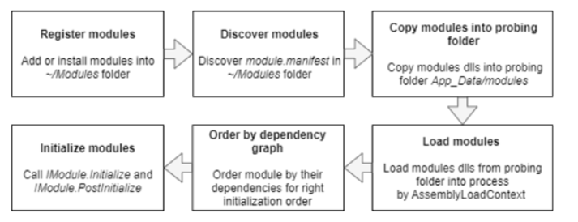

# How Platform Loads Modules into Application Process
The process of loading modules into the Virto platform application process includes the following steps:

- Discovering or registering modules: The modules to load at the first run in runtime are defined in the discovery folder called `~/modules`. This folder contains the module folder tree, with each module folder containing the _module.manifest_ file and other module resources, such as assemblies, JavaScript files, style bundles, and localization resources.

- Copying module assemblies into the probing folder to apply the version conflict resolution.

> The current policy is as follows: the assembly with the latest version or latest date of modification always prevails when copying.
> 
> Copying assemblies into the probing folder prevents assembly lock issues that might happen when the same assemblies loaded into the application process at the same time can be modified during development or other activity.
> 
> In multi-instance platform configurations, only one instance checks or copies assemblies into the probing folder. This is achieved by distributed locking between instances through Redis: the instance that was started first copies the files, while other instances skip this process.

- Loading modules: The assemblies that contain the modules are loaded into the `AssemblyLoadContex.Default` default context of the application process. This phase requires the module assemblies to be retrieved from the probing folder.
    
- Ordering by dependency graph: All loaded modules are stored in the order of their dependencies for proper initialization order.
    
- Initializing modules: Finally, the modules get initialized, which means creating instances of the module class and calling the *Initialize* method against them via the `IModule` interface.

The chart below shows the module loading process:

> Note: The Virto platform's modularity engine supports only eager loading from local disk for modules.
