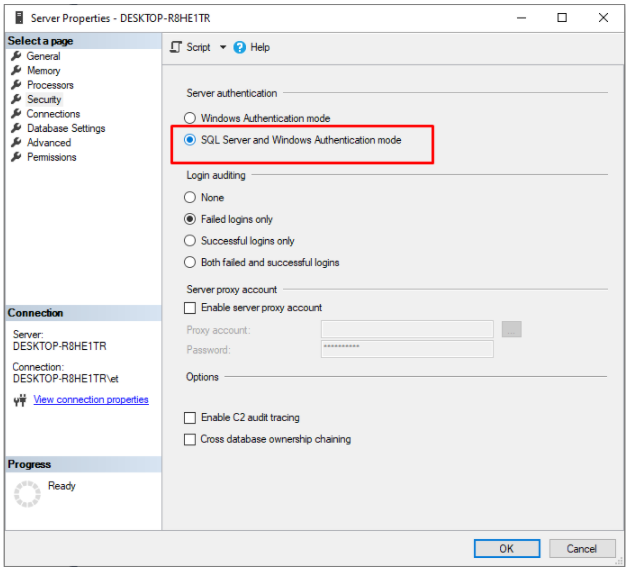

# Prerequisites
In order to run Virto Commerce, you will first need to install the below prerequisites.

## Required Software Components
This components must be installed in your Windows environment before running the Virto Commerce platform:

 - [ASP.NET Core Runtime 6.0.2](https://dotnet.microsoft.com/en-us/download/dotnet/6.0 "Installing ASP.NET Core Runtime")
 - [MS SQL Server 2017 or above](https://www.microsoft.com/en-us/sql-server/sql-server-downloads "Installing MS SQL Server")

*Note: After installing MS SQL server, please switch its authentication to mixed mode, as described [here](https://www.top-password.com/knowledge/sql-server-authentication-mode.html).*

- [Virto Commerce CLI](https://github.com/VirtoCommerce/vc-build), our proprietary command line interface that enables automating the installation process and updating the dependencies.

## Optional software components
For VirtoCommerce 3.200 or above, we recommend you installing MS Visual Studio 2022 (version 17.0 or above). You might also want to install [.NET 6 SDK](https://dotnet.microsoft.com/en-us/download/dotnet/6.0 "Installing .NET 6 SDK") in case you will need to edit the source code.

For better search capabilities, you can install [Elastic search 7.15](https://www.elastic.co/downloads/past-releases/elasticsearch-7-15-0). By default, VirtoCommerce uses [Lucene .NET](https://lucenenet.apache.org/); however, it has very limited functionality and cannot be used in production.
