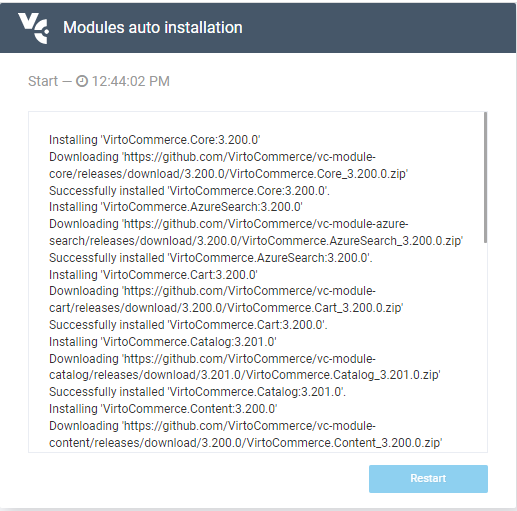
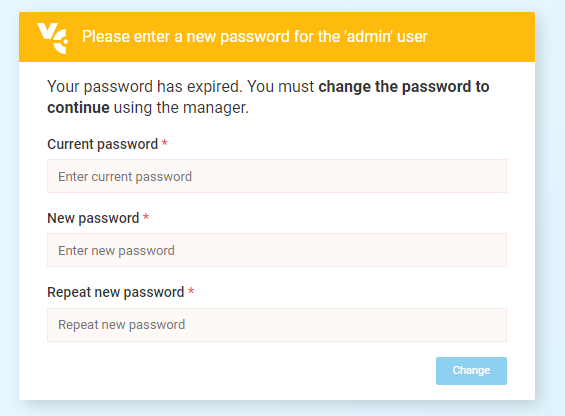


# Installation Using Virto Commerce CLI
This guide will explain you how to install VirtCommerce in demo mode on Windows using Virto Commerce's proprietary command line interface (CLI).

Virto Commerce Global Tool CLI, or *vc-build*, is our official [.NET Core GlobalTool](https://docs.microsoft.com/en-us/dotnet/core/tools/global-tools "https://docs.microsoft.com/en-us/dotnet/core/tools/global-tools") that helps you build, test, and deploy releases, create and push NuGet packages, provide package management for projects based on VirtoCommerce, and automate common DevOps tasks.

## Installation Process
In order to install the Virto Commerce platform using CLI, do the following:

- Install *vc-build* by running this command:
`1dotnet tool install -g VirtoCommerce.GlobalTool`
- Create an empty folder on your local disk to house the platform files. For instance, if you want to install it to your `C` drive, type:
`1cd c:\vc-platform`
- Run the following command to install both platform and modules with the latest versions:
`1vc-build install`

Once you are done, you will have the latest platform application release with the default module settings installed to your `C:\vc-platform` folder.

> ***Note:*** *You also can use vc-build for other operations, such as updating the existing Virto packages or installing new ones. You can find more information on this [here](https://github.com/VirtoCommerce/vc-build/blob/main/docs/CLI-tools/package-management.md).*

## Post Installation Steps
Once you have install the platform, you will need to perform a few additional steps to get it up and running. These steps are described below.

### Adjusting SQL Connection Settings
Open the *appsettings.json* file in your text editor and change the `VirtoCommerce` string in the `ConnectionStrings` section.

> ***Important:*** *The provided user must have enough permissions to create a new database.*

<details><summary>ConnectionStrings Section Example</summary>
```
"ConnectionStrings": { 
"VirtoCommerce" : "Data Source={SQL Server URL};Initial Catalog={Database name};Persist Security Info=True;User ID={User name};Password={User password};MultipleActiveResultSets=True;Connect Timeout=30" 
},
```
</details>

This is how the string in question may look like after you change it:

`appsettings.json`

`"VirtoCommerce": "Data Source=(local);Initial Catalog=VirtoCommerce3;Persist Security Info=True;User ID=virto;Password=virto;Connect Timeout=30",`

### Installing Self Signed SSL Certificate
Another step before launching the platform is installing and trusting the HTTPS certificate.

In order to trust the certificate, run this command:

`dotnet dev-certs https --trust`

For more information, please refer to [this Microsoft article](https://docs.microsoft.com/en-us/aspnet/core/security/enforcing-ssl?view=aspnetcore-3.0&tabs=visual-studio#trust). 

## Launching Platform
In order to launch the platform, run this command:
```
dotnet VirtoCommerce.Platform.Web.dll
```
*Note: The command above will run the Platform enforcing the HTTPS schema. You can also add HTTP URLs in the `--urls` argument of the `dotnet` command for development or demo purposes (see below). For security reasons, however, you should never use it in the production mode.*
```
dotnet VirtoCommerce.Platform.Web.dll --urls=http://localhost:5000
```

## First Time Launch
To launch the platform for the first time, open your browser and type http://localhost:5000 or https://localhost:5001. You may get the *Your connection is not private* error; in this case, click *Advanced* and then *Proceed to...*:


You can also remove this error using a [self signed certificate](https://www.hanselman.com/blog/DevelopingLocallyWithASPNETCoreUnderHTTPSSSLAndSelfSignedCerts.aspx).

The application will then create and initialize the database. After that, you should see the sign in page. Supply *admin* for login and *store* for password.

After you log into the platform for the first time, the installation wizard will show up and download default modules and sample data:



Once the wizard is done installing, you will be prompted to reset the default credentials:



This is it! Your platform is good to go.
