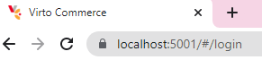

# Setting up Self-signed SSL Certificate
Running Virto Commerce Platform with HTTPS requires using an SSL certificate. When it comes to non-production applications or development and testing scenarios, you can use a self-signed certificate (see also sections *Installing Self Signed SSL Certificate* and *First Time Launch* of the [Installation Guide](Getting-Started/Installation-Guide/Installing-on-Windows/02-installation-windows-on-premises-precompiled-binaries.md)). Although such a certificate implements full encryption, the visitors of your website will see a browser warning saying the certificate should not be trusted.

Thus, when you first launch the platform with HTTPS enabled at [https://localhost:5001](https://localhost:5001/), you may also get this warning:

This is because it is an untrusted SSL certificate generated locally:

In this case, you can use the `dotnet dev-certs` command to work with self-signed certificates. All you need to do is run `1dotnet dev-certs https --trust`, which will take you to a popup dialog asking whether you want to trust this localhost certificate:

Click *Yes*, close your browser, and open it again at [https://localhost:5001](https://localhost:5001/). You will then see a trusted *Secure* badge in your browser (a lock icon):

To learn more about self-signed certificates, refer to this [Microsoft .NET guide](https://docs.microsoft.com/en-us/dotnet/core/additional-tools/self-signed-certificates-guide).

